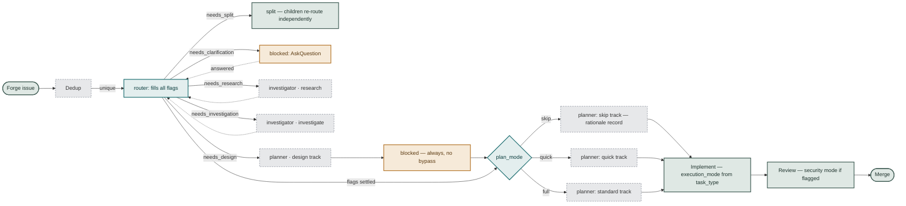

# Adaptive Routing — How Blackhole Decides What Each Issue Needs

Blackhole no longer runs one fixed pipeline for every issue. A **router agent** classifies each
issue once, into a single flag set, and the orchestrator derives everything downstream — which
steps run, which don't, how carefully Implement re-verifies behavior, whether a human has to
sign off before anything else happens — from that classification. This page is the reference for
how that works. For the file-layout / build-pipeline map, see
[documentation/architecture.md](../architecture.md); for the full design rationale and
trade-offs, see [ADR-004](../decisions/ADR-004-adaptive-phase-routing.md).

## Why: the problem with one fixed pipeline

Before this system, every issue — a one-line typo fix or a genuine architectural decision —
went through the same mandatory sequence: Handle → Plan → Implement → Review → Loop, with a full
plan document required before implementation could start. That's predictable, but it means a
trivial fix pays the same planning cost as a hard problem, and there was no way to insert a
design step, an investigation step, or an external-research step when an issue actually needed
one.

## The agent roster

Seven agents, each with one job:

| Agent | Role | Model |
|-------|------|-------|
| `coordinator` | User-facing intake layer; manages the background orchestrator, resolves blockers, triages chat feedback | sonnet |
| `orchestrator` | Derives the execution chain from each issue's route, spawns workers, merges on approval — never implements or writes artifacts itself | sonnet |
| `router` | Classifies each issue into the complete `route{}` object in one pass; never plans, implements, or spawns workers | sonnet |
| `investigator` | Evidence-gathering only — `research` (external docs/changelog lookup) and `investigate` (root-cause hypothesis loop) sub-modes; never plans or implements | sonnet |
| `planner` | Produces plan/design artifacts across four tracks: `skip`, `quick`, `standard`, `design` | sonnet |
| `implementer` | Builds in an isolated git worktree, TDD-first, execution discipline set by `task_type` | sonnet |
| `reviewer` | Audits every PR; security-mode when flagged; docs-only and skip-mode get their own compensating checks | sonnet |

`router` and `investigator` are new. `planner` and `implementer` are extended (new tracks / new
execution modes) — their core default behavior (a normal feature or bugfix, full plan, standard
TDD) is byte-for-byte what it always was.

## The route contract

The router writes one object per issue to `queue.json`:

```json
"route": {
  "needs_split": false,
  "needs_clarification": false,
  "needs_research": false,
  "needs_investigation": true,
  "needs_design": false,
  "task_type": "bugfix",
  "plan_mode": "quick",
  "security_review_required": false,
  "confidence": { "split": 95, "design": 80, "plan_mode": 70, "security": 90 },
  "body_hash": "<sha of issue title+body at classification time>",
  "computed_at_phase": "handle",
  "revision": 1
}
```

A few rules make this contract safe to act on autonomously:

- **Per-flag confidence, not one score.** A wrong `needs_split` is an annoyance; a wrong
  `security_review_required: false` on a pipeline that merges without a human in the loop is an
  incident. Each flag gates on its own confidence and falls back to its own cautious default when
  uncertain (`plan_mode` → `full`, `security_review_required` → `true`, `needs_design` → `true`).
- **`task_type` is computed from the issue's content, not from forge labels.** A human-authored
  label is only a cautious tie-break — if it conflicts with the content-derived read, the more
  cautious classification wins.
- **`body_hash` + `revision` are staleness markers.** If the issue body changes, or evidence lands
  that postdates the current revision, downstream consumers must re-route before acting rather
  than trust stale flags.
- **Split voids everything else.** When `needs_split` fires, every other flag for that issue is
  discarded — children re-enter routing independently and get their own classification.
- **`needs_design` is the one flag with no confidence bypass.** Every other flag can act
  autonomously at high confidence. This one always blocks on a human decision — architectural
  direction stays yours regardless of how confident the classifier is.

## Re-route checkpoints

The router classifies once per evidence state, not once forever. A cheap re-invocation
re-validates downstream flags at three points, since blackhole's queue is asynchronous across
turns (unlike a single interactive session, evidence can arrive days after the initial pass):

| Checkpoint | Re-validated | Why |
|---|---|---|
| Clarify resolved | all flags | The human's answer may change everything |
| Research note lands | investigation, design, plan strategy, security | External docs may reveal a breaking change or CVE |
| Investigation note lands | design, plan strategy, security | Root cause may turn out to be architectural |

Flags already acted on (an artifact already exists) are never retroactively changed — re-routing
only affects steps that haven't executed yet.

## The flag-derived chain



## Workflows handled

Every route flag exists because a real capability needed a home. None of these are cosmetic
labels — each one changes concrete agent behavior:

| Situation | Flag / mechanism | What actually happens |
|---|---|---|
| Issue is too big for one reviewable PR | `needs_split` | Split into child issues; each gets its own independent route |
| Requirements are ambiguous | `needs_clarification` | `status: blocked`, async `AskQuestion` — resolved whenever a human next engages, no live turn required |
| Issue names a specific external dependency/API/breaking change | `needs_research` | `investigator · research` — multi-source lookup (codebase + external docs/changelogs), every claim cited and cross-referenced against actual code |
| Bug-type issue with unclear root cause | `needs_investigation` | `investigator · investigate` — ranked hypotheses with evidence for/against, cheapest test first, loops until confirmed or exhausted |
| Architecturally significant, or touches a security-adjacent path | `needs_design` | `planner · design` — alternatives with a trade-off matrix, adversarial evaluation via parallel design-track spawns arguing distinct angles, component decomposition, design-principles validation, refactoring-impact analysis, assumption audit. **Always** human-gated |
| Low risk, high confidence | `plan_mode: skip` | Orchestrator dispatches to `planner`'s skip track, which deterministically writes a 4-line rationale record (Objective / Touch-Paths / Why-no-plan / Rollback) — no full plan spawn |
| Medium risk | `plan_mode: quick` | `planner`'s Quick track — inline plan, no formal document |
| High risk, or low confidence even after a cheap local scan | `plan_mode: full` | `planner`'s Standard track — the unchanged, original default |
| Router confidence is borderline before defaulting to a full plan | local-analyze | A direct grep/glob scan by the router itself, scoped to the issue's declared Touch-Paths, no agent spawn. Can only ever raise `security_review_required`, never lower it, if it touches a security-adjacent path |
| Refactor-type change | `task_type: refactor` → `execution_mode: refactor-strict` | Mandatory Decision Record before the first edit, per-step commit/rollback, the pre-existing test suite must pass unmodified, an in-scope Scout Check improvement expected |
| Docs-only change | `task_type: docs` → `execution_mode: docs-only` | TDD mandate suppressed, touch-paths restricted to doc paths, staleness/drift check against current code, code-block example verification |
| Security-adjacent PR | `security_review_required` | Diff-scoped exploitability audit — every finding needs a concrete attack scenario (no theoretical OWASP-category matches), a second independent pass tries to disprove each finding before it can block merge, a findings artifact must structurally validate before the PR can merge |
| Fix that fails twice, or grows past its declared scope | `escalation_trigger` | Re-routes through investigation, or escalates `plan_mode` to `full` |

## Human-in-the-loop

Two shapes of human gate exist, and they're deliberately different:

- **Soft, confidence-gated**: most flags act autonomously above their confidence threshold and
  fall back to a cautious default below it. No human turn required for the common case.
- **Hard, unconditional**: `needs_design` and any genuine ambiguity (`needs_clarification`) always
  block on `status: blocked` + async `AskQuestion` — resolved whenever a human next engages the
  campaign, not a live synchronous gate. Architectural direction and anything genuinely unclear
  stay a human call regardless of classifier confidence.

You can also intervene directly in chat at any point — new requests get triaged and filed as
issues (`gh issue create`), and the sync loop registers them in the queue automatically; responses
to an active blocker resume the orchestrator.

## Continuous discovery and Pareto gating

The campaign doesn't just implement what's asked — it surfaces what it notices along the way.
During implementation and review, agents log any worthwhile improvement (bugs, refactors, missing
coverage, doc drift) without acting on it in the active PR (`V-SCOPE-02` — no scope creep). Each
discovery gets a Gain (1–10) and Effort (1–10) score:

$$\text{Priority} = \text{Gain} \times (11 - \text{Effort})$$

Priority ≥ 30 files a new tracking issue and joins the active queue, sorted by priority
descending. Below that, it's logged to `findings-ledger.json` as `archived` — visible, but not
noise in the active backlog.

## What stays exactly as it was

Implement's TDD core for the default (`standard`) execution mode, Review's iteration budget and
LGTM mechanics, and merge/branch-linkage gates (`V-GIT-01`, `V-BRANCH-*`) are all untouched by
this system — verified explicitly so the router's blast radius stays bounded to *routing*
decisions, not *execution correctness*.
