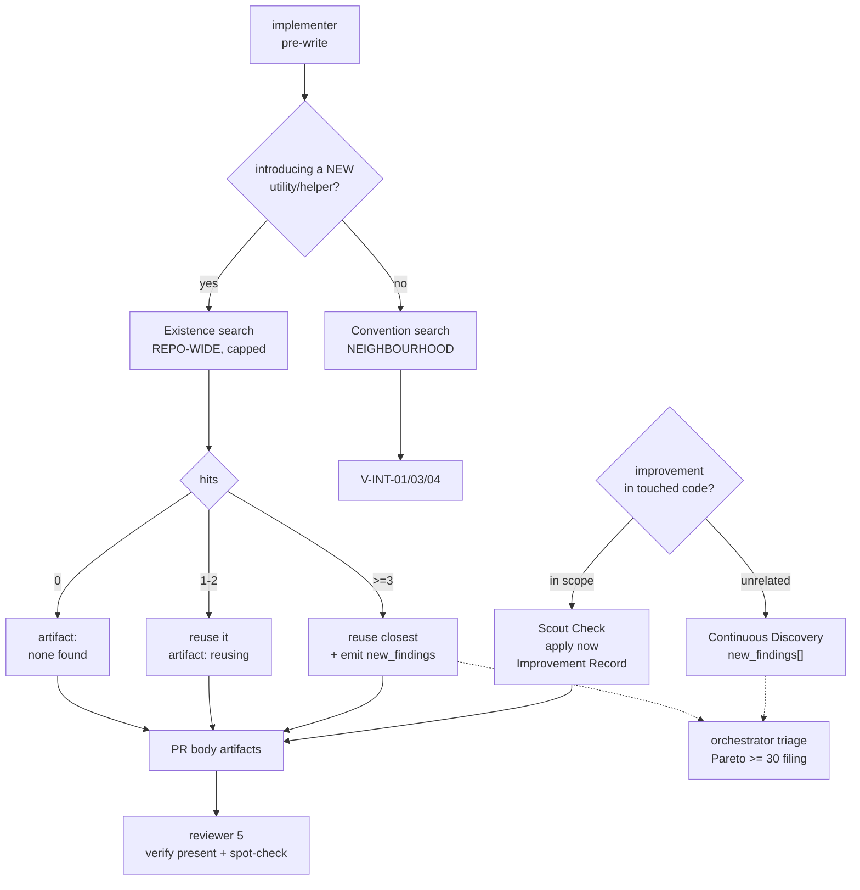

# ADR-011 — Implement-time accretion control

## Status

Proposed

Amends ADR-008 § B (reuse gate aperture). Paired with ADR-012, which owns the artifact
substrate concerns from the same investigation.

> **Blocking relationship**: ADR-012's **E5** (`autonomy` default flip) is sequenced *after*
> this ADR's D1/D2 land in `implementer.md`. If this ADR is re-scoped, reverted, or
> re-ordered, ADR-012 E5's precondition must be re-checked. The dependency is stated in both
> directions deliberately — one-directional prose is not enforceable.

## Overview

Blackhole's pre-write reuse gate is unconditional and structurally sound, yet nine bespoke
JSON read+parse sites accumulated in this repo before a hunter wave caught them. The gate
asks two questions through one grep whose aperture is correct for only one of them. This
ADR splits the aperture, adds a rule-of-three threshold that routes systemic duplication
into the existing discovery pipeline, and separates Scout Check from deferral by diff scope
rather than by execution mode.

Scope is deliberately narrow: implement-time accretion only. Artifact durability,
co-existence, and autonomy sequencing are ADR-012.

## Context

**Reported symptom**: campaigns need repeated kaizen `refactor` waves for code that should
have been implemented well the first time.

**Refutation 1 — the gates already exist.** ADR-010 landed between
`autonomous-workflow-parity.md` (2026-07-15) and this investigation. Verified present
today: durable artifact contract (`artifact-contract.md:15`), companion-file bootstrap
(`SKILL.md:50-56`), Convention Catalog cache (`planner.md:69-76`), unconditional pre-code
reuse gate (`implementer.md:87-105`), Approach Verification and Scout Check (scoped to
`task_type: bugfix` + `execution_mode: refactor-strict`).

**Refutation 2 — Scout Check could not have caused the symptom.** All nine hunt-origin
`[Kaizen]` issues (#274–#282) concern untouched pre-existing code found by hunter scans:
nine files of JSON parsing, a 253-line `main()`, coverage gaps in unmodified files. Scout
Check is diff-bounded by construction (`V-SCOPE-01`) and would have prevented **zero** of
them. Those waves are ADR-006 working as designed and will continue.

### Finding 1 — the reuse aperture is wrong for one of two questions

`implementer.md:87-105` greps *"the plan's declared **Touch-Paths** … and their immediate
neighbourhood"*. Duplication scattered outside Touch-Paths is invisible. At site 2 the gate
honestly records `none found — first occurrence`; at site 10, the same.

| Question the gate asks | Correct aperture | Current |
|---|---|---|
| Does an implementation of this concern exist *anywhere*? | repo-wide | Touch-Paths ❌ |
| What is the established *local* idiom here? | neighbourhood | Touch-Paths ✓ |

### Finding 2 — Scout and deferral are split by mode, not by scope

`implementer.md:72-84` frames them as mutually exclusive branches — *"Inverted for exactly
two conditions"*. They are orthogonal rules separated by the diff boundary: in-scope
improvement → apply now; unrelated discovery → triage and file. Selecting between them by
execution mode means standard feature work has **no** in-scope improvement obligation at all.

## Decision

**D1 — Split the Reuse Check aperture, add a rule-of-three threshold.**

Two sub-searches inside the existing gate:

- *Existence search* — **repo-wide, result-capped**. Fires only when the worker is about to
  introduce a **new** utility, helper, or abstraction (not when editing existing code).
- *Convention search* — **neighbourhood**, unchanged from ADR-008.

Threshold: ≥3 bespoke occurrences of the same concern means the correct action is
extraction, which is out of scope for the current issue (`V-SCOPE-01/02`). The worker reuses
the closest match **and** emits a `new_findings[]` extraction entry, triaged through the
existing Pareto ≥ 30 filing path. Never dropped, never silently absorbed.

Artifact records aperture and hit count so the claim is falsifiable:

- `Reuse Check: reusing <name> (<file:line>)` — unchanged
- `Reuse Check: none found — first occurrence of <concern> (repo-wide)`
- `Reuse Check: <N> bespoke occurrences of <concern> — reusing <closest>, extraction filed`

`reviewer.md` §5 additionally spot-checks that a `none found` claim survives an independent
repo-wide grep. A refuted claim is `V-INT-02`.

*Had this been in force, #280 would have been filed at site 3 by an implementer rather than
at site 9 by a hunter wave.*

**D2 — Separate Scout Check from deferral by scope, not by mode.**

Delete the "inverted for exactly two conditions" branch. Both rules become unconditional and
orthogonal: Scout Check (in-scope improvement to already-touched code → apply, record an
Improvement Record) and Continuous Discovery (unrelated → `new_findings`). `reviewer.md`
verifies the Improvement Record is present, mirroring the Reuse Check verify half.

> **Justified on SRP/DRY/KISS grounds only.** It removes a conditional and consolidates four
> near-duplicate statements. It is explicitly **NOT** claimed to reduce kaizen refactor
> yield — Finding 2 refutes that. Its cost (an Improvement Record on every PR, verified by
> the reviewer, including Quick-track) is accounted for in Risk R4.

**D3 — Amend `autonomous-workflow-parity.md` §2b.** Its `APEX Implement | Parity` row and
its conclusion *"every gap is on the thinking side"* are contradicted by Findings 1 and 2.
**Both axes are real and independent**: that audit's product/design-fit axis (G1–G11,
addressed by ADR-010) and this ADR's implement-side axis. Neither supersedes the other.

**D4 — Reconcile ADR-008's status.** `decisions/INDEX.md` shows `Proposed` though it
shipped. Set the INDEX `status` column and ADR-008's body `## Status` to `Accepted`;
frontmatter `status: current` is the orthogonal doc-governance axis and stays.

## Architecture

**Data flow**

1. Worker enters the pre-write gate with plan Touch-Paths.
2. If introducing a new utility → existence search runs repo-wide, capped; otherwise skipped.
3. Convention search runs over the neighbourhood (unchanged).
4. Hit count selects the artifact form; ≥3 additionally emits a `new_findings[]` entry.
5. Worker implements; in-scope improvements are applied and recorded, unrelated ones deferred.
6. PR body carries Reuse Check + Improvement Record entries.
7. Reviewer verifies presence and independently spot-checks one positive and one negative claim.
8. Orchestrator triages `new_findings[]` through the existing Pareto path.

## Components

| # | Component | Responsibility | Interface | Dependencies |
|---|---|---|---|---|
| 1 | `implementer.md` § Reuse Check Gate | Decide reuse vs. first-occurrence vs. extraction | PR-body `Reuse Check:` line | plan Touch-Paths; repo-wide Grep |
| 2 | `implementer.md` § Scout Check | Apply one in-scope improvement | PR-body `Improvement Record:` line | diff boundary (`V-SCOPE-01`) |
| 3 | `implementer.md` § Continuous Discovery | Defer unrelated findings | `new_findings[]` in worker JSON | `worker-schemas.md` schema (unchanged) |
| 4 | `reviewer.md` § 5 | Verify + spot-check both artifacts | BLOCK finding on absence; `V-INT-02` on refutation | PR body |
| 5 | `phase-implement.md` | Assemble worker prompt expectations | 5-field contract text | components 1–3 |

## Design Principles Validation

| Principle | Verdict | Note |
|---|---|---|
| **SRP** | ✅ Improved | Both D1 and D2 split a conflated concern: one grep answering two questions; one branch selecting two orthogonal rules |
| **OCP** | ✅ Improved | New execution modes inherit both rules automatically; today adding a mode requires editing the inversion list |
| **LSP** | ✅ Improved | Execution modes become substitutable — today two behave oppositely under the same step |
| **ISP** | ✅ Pass | Reviewer gains two narrow spot-checks, not a broad interface |
| **DIP** | ✅ Pass | Reviewer depends on the PR-body artifact contract, never on implementer internals |
| **DRY** | ✅ Improved | Consolidates four near-duplicate Scout Check statements (`implementer.md:79-82,124-126,142-145`, `phase-implement.md:38,63`) into one section plus pointers |
| **KISS** | ⚠️ Mixed | D2 removes a conditional (net simpler). D1 adds one branch and a threshold. No new gate, agent, or file — net conditional count roughly neutral |
| **YAGNI** | ✅ Pass | Both decisions trace to verified findings (#280; `implementer.md:72-84`). No speculative extension points |
| **Separation of Concerns** | ✅ Pass | Worker detects; orchestrator triages and files; reviewer verifies. Three owners, no overlap |
| **Composition over Inheritance** | ✅ N/A | Markdown prompt contract, no type hierarchy. Shared-section-plus-pointer replaces copy-paste, which is the compositional analogue |
| **Law of Demeter** | ✅ Pass | Reviewer reads the PR-body artifact; never reaches into worker state |
| **Fail Fast** | ✅ Pass | Detection is pre-write; missing artifact is BLOCK at review, at the boundary |
| **GoF — Creational** | N/A | No object construction in scope |
| **GoF — Structural** | N/A | Prompt-contract change, not a code structure |
| **GoF — Behavioral** | Rejected | Strategy-per-execution-mode was considered — that is precisely what exists today and what D2 removes. A single uniform rule beats per-mode strategies (`V-YAGNI-03`, single-consumer abstraction) |
| **No forced patterns** | ✅ Pass | No pattern applied where it would add indirection |
| **Progressive Disclosure** | N/A | No UI surface |

## Trade-offs

| Decision | Option A | Option B | Choice |
|---|---|---|---|
| Reuse aperture | Keep Touch-Paths scope (cheap, misses cross-file duplication) | Repo-wide existence search (catches it, unmeasured token cost) | **B** — evidence (#280) shows A's failure is silent and compounding |
| Duplication ≥3 | Silently reuse closest | Reuse closest **and** file extraction | **B** — extraction is out of scope; never-drop requires filing |
| Scout/defer selection | By execution mode (status quo) | By diff scope | **B** — scope is the actual discriminator; mode selection leaves standard work with no obligation |
| Scope of this ADR | One ADR for all session findings | Split: accretion here, substrate in ADR-012 | **B** — one theme per ADR keeps each independently acceptable. Note: the repo's precedent is *mixed* — ADR-008 bundles three concerns and ADR-010 spans D1–D8, so this split is a deliberate improvement on precedent, not conformance to it |

## Alternatives considered

| Approach | Score | Disposition |
|---|---|---|
| **Aperture split + scope-based Scout** ✅ | **4.3 / 5** | Chosen — strengthens a sound gate, no new ceremony |
| Extend Scout Check as the primary fix | 1.8 / 5 | Refuted — all 9 kaizen issues out-of-diff; retained as D2 on design grounds only |
| Reviewer-side repo-wide duplication scan | 3.1 / 5 | Rejected — reactive; loses ADR-008's shift-left property |
| Planner-side reuse gate | 2.1 / 5 | Already rejected by ADR-008 — destroys Quick determinism, trips Accretion Guard |

Adversarial 3-critic evaluation was run for the ADR-012 injection question, not for this
table: the 4.3 vs 3.1 delta exceeds the >30% dominance threshold at which x-design's step 7b
permits skipping it.

## Refactoring Impact

### Changed Interfaces

| Component | Change type | Consumers (grep-identified) | Impact |
|---|---|---|---|
| `implementer.md` Reuse Check artifact | Format extension (adds aperture + hit count) | `reviewer.md` §5; `worker-schemas.md` | **DEPRECATION** — old 2-form artifact still parses; reviewer must learn the 3rd form |
| `implementer.md` Reuse Check search scope | Behaviour change | none (internal to the gate) | **TRANSPARENT** |
| `implementer.md` Scout Check trigger | Consumption pattern (mode-gated → unconditional) | `phase-implement.md:38,63`; `worker-schemas.md:362`; `planner.md:55` | **DEPRECATION** — mode-gated wording becomes incorrect; must be retargeted |
| `implementer.md` Continuous Discovery | Branch deleted | *Direct*: `worker-schemas.md`, `scripts/validate-worker-json.ts`. *Indirect* (via `findings-ledger.json`, not the field): `phase-loop.md` § Continuous Discovery; `orchestrator.md:185,366,387,399,436`; `config-template.md:64` | **TRANSPARENT** — the `new_findings[]` schema is unchanged; only volume shifts. Note the chain is worker → orchestrator single-writer append → ledger → `phase-loop.md`; no downstream file reads the field directly |
| `new_findings[]` schema | None | `scripts/validate-worker-json.ts` | **TRANSPARENT** — no schema change |
| ADR-008 § B | Amended | `documentation/decisions/INDEX.md` | **DEPRECATION** — aperture superseded; ADR-008 gains a pointer |

**0 BREAKING. 3 DEPRECATION. 3 TRANSPARENT.**

### Migration Plan

1. **Reuse Check artifact → 3-form** — Consumers: `reviewer.md` §5, `worker-schemas.md`.
   Change: accept the new `<N> bespoke occurrences` form and add the negative-claim
   spot-check. Order: reviewer before implementer, so the verifier never sees an
   unrecognised form. Rollback: reviewer tolerates all three forms, so reverting the
   implementer alone is safe.
2. **Scout Check trigger → unconditional** — Consumers: `phase-implement.md:38,63`,
   `worker-schemas.md:362`, `planner.md:55`. Change: delete mode-gated qualifiers; retarget
   pointers to the consolidated section. Order: same PR as the implementer edit — these are
   documentation pointers that would otherwise describe a state that no longer exists.
   Rollback: single revert; no persisted state involved.
3. **ADR-008 § B pointer** — add an "aperture superseded by ADR-011 D1" note; INDEX status
   to `Accepted` (D4).

### Migration Strategy

- **Phased migration needed**: **Yes** — 6 changed interfaces across 7 consumer files
  exceeds the >5 threshold. Phase 1 = reviewer tolerance (step 1), Phase 2 = implementer
  behaviour + pointer retargeting (steps 2–3).
- **Backward compatibility period**: the 3-form artifact is additive; old forms remain valid
  indefinitely. No sunset required.
- **Feature flag recommended**: **No** — changes are prompt-contract only, reverted by a
  single `git revert` plus `bun run build`. Existing `docs_governance` / `autonomy` kill
  switches do not apply to either decision.

## Risk Assessment

| ID | Risk | Impact | Mitigation |
|---|---|---|---|
| R1 | Repo-wide grep cost per new-utility introduction is unmeasured | Medium | Result cap; fires only on new-utility introduction, not on every edit; measure on first campaign and revisit the cap |
| R2 | Lexical grep misses semantically-duplicated concerns expressed in varied idioms | Medium | Accepted as a floor, not a ceiling — hunter `refactor` kind remains the backstop for semantic duplication |
| R3 | Rule-of-three fires on false positives, filing noise issues | Low | Existing Pareto ≥ 30 gate already filters below-threshold findings; `V-HUNT-02` cap analogue applies at triage |
| R4 | D2 adds an Improvement Record obligation to every PR incl. Quick-track, with no claimed benefit against the primary symptom | Medium | Record may state "no improvement needed — code already clean"; reviewer checks presence, not substance. Revisit if Quick-track PR overhead becomes visible |
| R5 | Reviewer spot-checking a *negative* claim (`none found`) is costlier than a positive one | Low | Spot-check one claim per PR, not all; same sampling discipline as the existing Drift-Check spot-check |
| R6 | Workers rubber-stamp `none found` without searching | Medium | This is exactly why D1 adds the reviewer-side repo-wide spot-check; refuted claim is `V-INT-02` (BLOCK) |

## Key assumptions

| Marker | Assumption |
|---|---|
| ✓ Validated | Nine bespoke JSON sites accumulated despite an unconditional reuse gate — #280, `implementer.md:87-105` |
| ✓ Validated | All 9 filed `[Kaizen]` issues are out-of-diff hunter findings — ledger `phase: hunt` rows, issues #274–#282 |
| ✓ Validated | Self-reported worker gates require a reviewer half — `reviewer.md:74-78`, `phase-implement.md:75-82` (issue #204) |
| ✓ Validated | Scout Check is mode-gated today — `implementer.md:78` "Inverted for exactly two conditions" |
| ~ Contestable | Repo-wide grep cost is acceptable — unmeasured (R1) |
| ~ Contestable | Rule-of-three is the right threshold — chosen for consistency with `V-DRY-02`'s 3–10 line band |
| ⚡ Oversimplified | "The concern" is assumed greppable; semantic duplication will slip through (R2) |

## Implementation Order

1. `reviewer.md` §5 — accept the 3-form artifact, add negative-claim spot-check and
   Improvement Record verification *(foundation — verifier tolerates before producer emits)*
2. `implementer.md` — aperture split, rule-of-three, consolidated unconditional Scout Check,
   delete the inversion branch *(depends on 1)*
3. `phase-implement.md`, `worker-schemas.md`, `planner.md:55` — retarget pointers, delete
   mode-gated qualifiers *(same PR as 2)*
4. ADR-008 § B pointer + INDEX status → `Accepted` (D4) *(independent)*
5. `autonomous-workflow-parity.md` §2b amendment (D3) *(independent)*

## Consequences

**Positive**

- Systemic duplication is filed at occurrence 3 by an implementer instead of occurrence 9 by
  a hunter wave.
- `Reuse Check: none found` becomes falsifiable, closing the rubber-stamp risk.
- No new gate, agent, schema, or `##` section — V-CONTENTGATE-01, the Accretion Guard, and
  the Extension Tax are untouched.
- Execution modes become substitutable; adding a mode no longer requires editing an
  inversion list.

**Negative**

- Unmeasured grep cost (R1); lexical-only detection (R2).
- D2 adds per-PR overhead with no claimed benefit against the reported symptom (R4).
- Hunter-origin kaizen volume over pre-existing legacy code is **not** reduced. Expect it to
  continue — that is ADR-006 functioning correctly.

**Metric correction**

The originating metric — *"kaizen refactor yield trends to zero"* — is unachievable and is
retired: no diff-bounded mechanism reaches out-of-diff legacy debt. Replacement: **new
duplicate-concern sites are filed at occurrence ≤3 rather than discovered later by hunt.**
