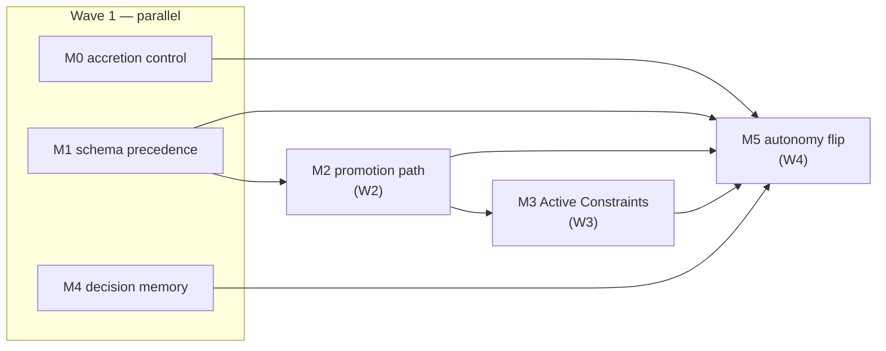

# Initiative — Companion Substrate Closure

Implements ADR-011 and ADR-012: stop implement-time duplication accreting, and make the
artifacts blackhole produces durable, schema-compatible with mercure, and reachable by
future work.

**Goal**: blackhole is *autonomous mercure over a shared artifact substrate* — mercure
builds with the user, blackhole builds unattended and interrupts only when genuinely needed,
both at the same code quality, on the same repo-local files.

**Execution**: mercure initiative (`/x-plan` → `/x-implement` per milestone). Deliberately
**not** run as a blackhole campaign: M0 modifies `implementer.md` and `reviewer.md`, so a
self-hosted campaign would have the reviewer review a change to its own contract mid-run.

## Milestones

| M | Title | Wave | Depends on | Status |
|---|---|---|---|---|
| M0 | ADR-011 — implement-time accretion control | W1 | — | pending |
| M1 | E1 — repo-convention schema precedence | W1 | — | pending |
| M4 | E4 — durable decision memory | W1 | — | pending |
| M2 | E2 — human-approved promotion path | W2 | M1 | pending |
| M3 | E3 — Active Constraints write path | W3 | M2 | pending |
| M5 | E5 — autonomy default flip | W4 | M0–M4 + green campaign | pending |

## Binding constraints

Carried from the ADRs and from ADR-010's still-binding design constraints:

1. **`src/` is the only editable source.** Every platform tree (`.claude/`, `.cursor/`,
   `codex-*`, `.agents/build/`, `plugins/*`) is build output — edit `src/`, then
   `bun run build`. CI blocks drift.
2. **M0 has a binding intra-milestone order**: `reviewer.md` tolerance lands *before*
   `implementer.md` emits the new artifact form, or the verifier meets an unrecognised form.
3. **M5 lands alone, last.** It is the only BREAKING change (3 behavioural consumers) and
   must follow one green campaign. Rollback is `autonomy.enabled: false`.
4. **The planner never computes its own design-autonomy verdict** (ADR-010, critic-confirmed
   "self-graded homework" risk). M2's third branch promotes on a *human's* verdict passed in
   as directive context — it does not decide.
5. **No new agent, no named workflow chains** (ADR-010 rejected alternatives, still binding).
6. **V-CONTENTGATE-01**: `orchestrator.md` sections are grow-never; extend via a new budgeted
   section plus a one-line pointer, never inline growth.
7. **Single-writer invariant**: workers never write `queue.json`, `findings-ledger.json`, or
   (per M4) `decision-log.md`. They return data; the orchestrator appends serially.

## Known live bug fixed here

`phase-plan.md` sets `notes: awaiting-design-approval` for `track: design`, but
`coordinator.md:185` and `queue-dag.md:39` do not recognise it — **design-track blocks never
resume today**. Repaired in M2 task 1. Independent of the ADRs; consider filing separately if
it needs to ship before M1.

## Success criteria

- [ ] New duplicate-concern sites filed at occurrence ≤3 rather than found later by hunt
- [ ] Design decisions reach `documentation/decisions/` on both autonomous and human-approved paths
- [ ] Implementation decisions greppable in `documentation/reference/decision-log.md`
- [ ] mercure and blackhole emit compatible INDEX rows and ADR frontmatter on a shared repo
- [ ] Blackhole stops blocking on design gates it can decide, without acquiring brainstorm
      terminal-closure semantics

## Retired metric

*"Kaizen refactor yield trends to zero"* is **unachievable** and retired. All nine filed
`[Kaizen]` issues (#274–#282) are out-of-diff hunter findings over pre-existing code; no
diff-bounded mechanism reaches them. Hunter-origin volume will continue — that is ADR-006
working correctly.
