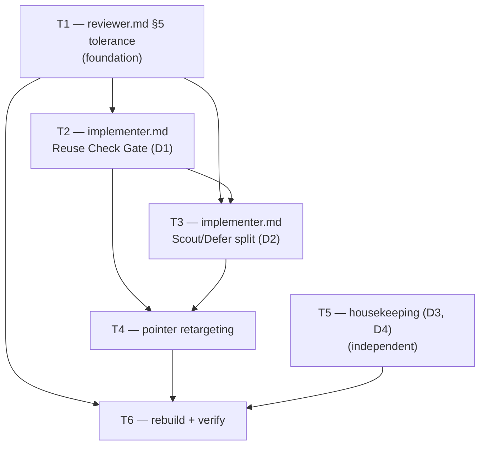

# Plan — M0: Implement-time accretion control (ADR-011)

> **Milestone M0** · Wave 1 · Depends on: — · Status: pending
>
>  **Binding order**: reviewer.md tolerance (T1) lands before implementer.md emission (T2) — see Issue DAG.

## Objective

Implement ADR-011 D1–D4 inside the `companion-substrate-closure` initiative's M0: widen the
`implementer.md` Reuse Check Gate's aperture (repo-wide existence search vs. neighbourhood
convention search, plus a rule-of-three duplication threshold), separate Scout Check from
Continuous Discovery by diff scope instead of execution mode, extend `reviewer.md` § 5 to
tolerate and spot-check the widened artifact, retarget every stale pointer, and reconcile
`autonomous-workflow-parity.md` §2b + ADR-008's status with the corrected picture. Scope is
implement-time accretion only — no artifact-durability or autonomy-sequencing concerns (those
are ADR-012, a separate milestone).

**Binding order** (ADR-011 Migration Plan step 1, milestone-0.md "Binding task order"):
`reviewer.md` § 5's 3-form tolerance (T1) MUST land before `implementer.md`'s 3rd-form
emission (T2/T3) — either as an earlier merged commit or ordered ahead of T2/T3 within the same
PR. Landing T2/T3 first would have the reviewer reject a well-formed 3rd-form artifact as
unrecognized.

**TDD honesty note**: this milestone is markdown prompt-contract edits across `src/agents/*.md`,
`src/references/*.md`, and `documentation/`. No `.ts` logic is added or changed, and this repo
has no `.md`-prompt test harness — `bun test` coverage does not apply to any task below (T4's
predecessor plan, `plan-routing-visibility-reuse-gate.md` B4, establishes this precedent
explicitly). Every task is verified instead by `bun run verify`'s structural checks
(V-DELEG-01, V-VCODE-01, V-LINK-01, V-SCHEMA-01, V-GROUND-01) plus a human read-through against
ADR-011's literal artifact-form strings. This is stated once here rather than repeated as a
caveat on every task below (`V-DRY-01`).

## Touch-Paths

- `src/agents/reviewer.md`
- `src/agents/implementer.md`
- `src/agents/planner.md`
- `src/references/phase-implement.md`
- `src/references/worker-schemas.md`
- `documentation/audits/autonomous-workflow-parity.md`
- `documentation/decisions/ADR-008-routing-visibility-reuse-gate.md`
- `documentation/decisions/INDEX.md`

No `scripts/**` or `.claude/**` files are hand-edited — `.claude/**` is regenerated by T6's
`bun run build` from the `src/**` edits above.

## Strategy

Six tasks. T1 is the foundation (reviewer tolerance) and gates T2/T3 (implementer emission).
T2 and T3 both edit `src/agents/implementer.md` — sequenced within one agent session to avoid
merge conflicts, mirroring `plan-routing-visibility-reuse-gate.md`'s same-file sequencing
precedent (A2/A4/A5). T4 retargets pointers only after T2/T3's consolidated section exists. T5
(housekeeping) is independent of T1–T4 and can run concurrently. T6 (rebuild + verify) is the
terminal gate and depends on all five preceding tasks.

## Issue DAG

T2 → T3 is a same-session sequencing edge (both touch `implementer.md`), not a strict ADR
dependency — the ADR's own Implementation Order collapses D1+D2 into one step ("2.
`implementer.md` ... depends on 1"). T5 has no edge into T2/T3/T4 — it touches disjoint files.

## Task Breakdown

### T1 — `src/agents/reviewer.md` § 5 tolerance *(foundation — must precede T2/T3)*

**Depends on**: none.
**Touch**: `src/agents/reviewer.md` § 5 "Integration Coherence" (lines 72–86).

**Acceptance** (measurable):
- (a) § 5 documents acceptance of all three Reuse Check artifact forms: `reusing <name>
  (<file:line>)`, `none found — first occurrence of <concern> (repo-wide)`, and `<N> bespoke
  occurrences of <concern> — reusing <closest>, extraction filed` — verified by grepping the
  edited file for all three literal substrings.
- (b) § 5 adds a negative-claim spot-check bullet: independently re-verify at least one `none
  found` claim via a repo-wide grep; a refuted claim (grep surfaces a pre-existing match the
  implementer missed) is recorded as `V-INT-02`, severity `BLOCK`.
- (c) § 5 adds an Improvement Record presence-verification bullet, mirroring the existing
  Reuse Check verify-half prose at `reviewer.md:74-78` — a missing Improvement Record on a PR
  produces a finding (severity `WARN` — D2 explicitly disclaims a kaizen-yield benefit, and R4
  accepts "no improvement needed — code already clean" as valid content; only presence is
  checked, not substance).
- (d) `bun run verify`'s `src/agents/reviewer.md`-touching checks (V-DELEG-01, V-VCODE-01,
  V-LINK-01) show 0 new failures.

**Rollback**: single `git revert`; safe in isolation because no implementer session emits the
3rd form until T2 lands — reverting T1 alone restores the pre-ADR-011 2-form tolerance exactly.

### T2 — `src/agents/implementer.md` Reuse Check Gate (D1)

**Depends on**: T1.
**Touch**: `src/agents/implementer.md` § "Reuse Check Gate (unconditional)" (lines 87–105).

**Acceptance**:
- (a) The pre-write grep splits into two named sub-searches: *existence search* (repo-wide,
  result-capped, fires only when introducing a **new** utility/helper/abstraction) and
  *convention search* (Touch-Paths + immediate neighbourhood, unchanged) — both named
  explicitly in the edited text.
- (b) Rule-of-three: ≥3 bespoke occurrences of the same concern → reuse the closest match AND
  emit a `new_findings[]` extraction entry (gain/effort estimated per the existing Continuous
  Discovery convention, triaged through the existing Pareto ≥ 30 filing path) — verified by
  presence of this exact threshold rule.
- (c) The Reuse Check artifact template gains the 3rd form plus aperture + hit-count fields,
  matching ADR-011 D1's three literal forms.
- (d) The gate remains unconditional — no new mode/track conditional guard is introduced
  around the gate; the "applies to every execution mode and plan track" framing is retained.
- (e) A repo-wide match outside the plan's Touch-Paths is now reported (previously invisible
  per ADR Finding 1) — verified by the existence search's aperture reading "repo-wide", not
  "Touch-Paths and their immediate neighbourhood".

**Rollback**: single `git revert`; safe because T1 already tolerates all 3 forms — reverting
the implementer alone (ADR-011 Migration Plan step 1's explicit rollback note) leaves the
reviewer harmlessly over-tolerant of a form no implementer emits.

### T3 — `src/agents/implementer.md` Scout/Defer split (D2)

**Depends on**: T1 (Improvement Record verification must exist before Scout Check becomes
unconditional). Sequenced in the same agent session as T2 (same file — avoid merge conflicts).
**Touch**: `src/agents/implementer.md` step 7 "Continuous Discovery" (lines 72–84, delete the
inversion branch at lines 78–83), Bugfix Gate's Scout Check bullet (lines 124–126) —
consolidated into one canonical section plus pointers.

**Acceptance**:
- (a) The "Inverted for exactly two conditions" branch (current lines 78–83) is deleted in
  full — verified by zero matches for the literal string "Inverted for exactly two conditions"
  in the edited file.
- (b) Scout Check becomes unconditional and consolidated to exactly one canonical statement
  (currently two near-duplicates at lines 79–82 and 124–126, confirmed by grep of "Scout
  Check" returning 2 hits pre-edit) — the second occurrence becomes a pointer to the first.
- (c) Continuous Discovery (step 7, `new_findings[]`) stays unconditional and diff-scope
  bounded — no mode/track selects between it and Scout Check.
- (d) `V-SCOPE-01` still bounds Scout Check — the consolidated section retains "in-scope
  improvement to already-touched code"; the diff boundary (not execution mode) is the sole
  discriminator.

**Rollback**: single `git revert`; per ADR-011 Migration Strategy, no feature flag exists — a
`git revert` plus `bun run build` fully reverses this task with no persisted state involved.

### T4 — pointer retargeting

**Depends on**: T2, T3 (pointers must reflect the final consolidated section's actual
location — retargeting before T2/T3 land would point at prose that doesn't yet exist).
**Touch**: `src/references/phase-implement.md:38,63`, `src/references/worker-schemas.md:362`,
`src/agents/planner.md:55`.

**Acceptance**:
- (a) `phase-implement.md:38` — the "Bugfix Gate's Decision Record and Scout Check
  expectations" pointer drops any mode-gated qualifier and points at the consolidated section.
- (b) `phase-implement.md:63` — the `task_type` table row's Scout Check description keeps the
  Bugfix Gate framing but no longer implies Scout Check is conditional on `task_type: bugfix`
  alone (the Bugfix Gate is only the Root-Cause/escalation-trigger wrapper; Scout Check itself
  is unconditional per T3).
- (c) `worker-schemas.md:362` — the pointer sentence is retargeted from "the Scout Check /
  Improvement Record convention the same gate also produces" to the consolidated section.
- (d) `planner.md:55` — "Scout Check this stamp activates" is trimmed since the Bugfix stamp
  no longer uniquely activates Scout Check (it activates only the Root-Cause Verification gate
  and escalation triggers; Scout Check is unconditional).
- (e) `grep -rn "Inverted for exactly two conditions" src/` returns zero matches after the
  edit; no file in the touch-path set describes Scout Check as mode-gated.

**Rollback**: single `git revert`; documentation pointers only, no runtime behavior affected.

### T5 — housekeeping (D3, D4)

**Depends on**: none — independent of T1–T4 (ADR-011 Implementation Order marks both D3 and D4
"(independent)").
**Touch**: `documentation/audits/autonomous-workflow-parity.md` §2b (row at line 173,
conclusion at lines 186–190), `documentation/decisions/ADR-008-routing-visibility-reuse-gate.md`
(§ B lines 70–88, `## Status` at line 16), `documentation/decisions/INDEX.md` (ADR-008 row,
line 12).

**Acceptance**:
- (a) `autonomous-workflow-parity.md` §2b's "APEX Implement | Implementer, TDD, worktrees,
  execution modes | Parity" row (line 173) is amended to note the implement-side accretion
  gap (ADR-011 Findings 1/2) alongside the existing G7 delivery-boundary caveat — the row no
  longer reads unconditional "Parity".
- (b) §2b's closing sentence "every gap is on the thinking side" (lines 186–190) is amended:
  both axes are real and independent — the product/design-fit axis (G1–G11, addressed by
  ADR-010) and the implement-side axis (addressed by ADR-011) — neither supersedes the other.
- (c) ADR-008 § B (lines 70–88, "B. Proactive reuse") gains an "aperture superseded by
  ADR-011 D1" pointer without deleting § B's original text.
- (d) ADR-008 body `## Status` (line 16, currently "Proposed") is set to `Accepted`;
  frontmatter `status: current` (line 3) is left untouched (orthogonal doc-governance axis,
  D4).
- (e) `documentation/decisions/INDEX.md` line 12's status column for
  `ADR-008-routing-visibility-reuse-gate.md` changes from `Proposed` to `Accepted`.
- (f) No two docs contradict each other on implement-side parity after the edit — spot-check:
  `autonomous-workflow-parity.md` §2b and ADR-011 agree both axes are real and independent.

**Rollback**: independent single-file `git revert`s per file (or one combined revert since the
three files don't interact); zero runtime/behavioral risk — a documentation-currency
correction only.

### T6 — rebuild + verify

**Depends on**: T1, T2, T3, T4, T5.
**Touch**: none — verification only (`bun run build`, `bun run verify`, `bun test`); the only
expected diff is regenerated build output, which must show zero drift.

**Acceptance**:
- (a) `bun run build` exits 0 with a clean git diff against `.agents/build/`,
  `plugins/blackhole/`, `plugins/blackhole-claude/`, `codex-*` (no hand-edit drift — V-BUILD-01,
  V-GEMINI-01/02, V-CLAUDE-DIST-01, V-CODEX-01..04 all pass).
- (b) `bun run verify` exits 0, 28/28 checks pass, specifically: V-VCODE-01 (unchanged —
  `blackhole-vcodes.md` is not in this milestone's touch-paths), V-DELEG-01 (`reviewer.md` /
  `implementer.md` retain their 5-Field Delegation Contract sections), V-SCHEMA-01, V-LINK-01
  (every T4 pointer resolves), V-GROUND-01 (`AGENT_NAMES`/`REQUIRED_REFERENCES`/
  `VCODE_TABLE_ROW_COUNT` facts in `build.ts` unchanged — no new files added), V-CONTENTGATE-01
  (green — `orchestrator.md` is outside this milestone's touch-paths, so its content-gate
  baseline is untouched; confirmed against the risk note below).
- (c) `bun test` exits 0, zero failures, unchanged pass count vs. the pre-milestone baseline
  (this milestone adds no `.ts` logic).

**Rollback**: not applicable to T6 itself (produces no source diff). On failure: halt, do not
open the PR, attribute the failure to the specific T1–T5 task whose edit triggered it, fix that
task, and re-run T6 from scratch.

## Critical Files

| File | Change Type | Reason |
|------|-------------|--------|
| `src/agents/implementer.md` | Extend | Reuse Check Gate aperture split + rule-of-three; Scout/Defer consolidation. Every future implementer PR's behavior depends on this file's exact prose. |
| `src/agents/reviewer.md` | Extend | § 5 gains the BLOCK-severity spot-check gate — a false negative here silently reintroduces the rubber-stamp risk R6 was designed to close. |
| `documentation/decisions/ADR-008-routing-visibility-reuse-gate.md` | Amend | Status flip (Proposed → Accepted) affects how future readers interpret its § B aperture claim. |
| `documentation/decisions/INDEX.md` | Amend | Single-line status column; incorrect edits mislead the ADR index for every future reader (V-ADA-02). |

## Codebase Conventions

| Touchpoint | Convention | Source | Required by |
|------------|------------|--------|--------------|
| PR-body artifact gate ("no bypass", produced once, recorded in PR description) | `src/agents/implementer.md:78-89` (Bugfix Gate Decision Record), `:153-159` (docs-only Drift-Check Table) | V-INT-01..03 |
| Reuse Check artifact 2-form template (pre-milestone baseline) | `src/agents/implementer.md:98-101` | V-INT-02 |
| Reviewer verify-half pattern (presence check + spot-check, mirrored by T1) | `src/agents/reviewer.md:74-78` | V-INT-02, V-DRY-01 |
| `worker-schemas.md` pointer convention (one-sentence pointer, no content duplication) | `src/references/worker-schemas.md:362,365-366` | V-DRY-01 |
| ADR body `## Status` / `decisions/INDEX.md` status-column pairing | `documentation/decisions/INDEX.md:1-16`, ADR body `## Status` headers | V-ADA-02 |
| Reuse Check Gate section heading style ("### <Gate name> (unconditional)") | `src/agents/implementer.md:87` | V-INT-01, V-DRY-01 |

## Dependency Blast-Radius

| Changed File | Downstream Consumers | Blast Radius |
|--------------|----------------------|--------------|
| `src/agents/implementer.md` (Reuse Check Gate, Scout/Defer) | Every future implementer-spawned PR body; `src/agents/reviewer.md` § 5 (T1, same milestone) | MEDIUM — extends an already-required PR-body element; no new consumer outside this milestone's own T1 |
| `src/agents/reviewer.md` § 5 | Every future PR review pass | LOW — additive checks, backward compatible (old 2 forms remain valid indefinitely per ADR-011) |
| `src/references/phase-implement.md`, `src/references/worker-schemas.md`, `src/agents/planner.md` | Orchestrator prompt assembly at spawn time (`phase-implement.md` § "Worker prompt must include") | LOW — pointer/prose retargeting only, no schema change |
| `documentation/audits/autonomous-workflow-parity.md`, `documentation/decisions/ADR-008*.md`, `documentation/decisions/INDEX.md` | Human readers of the parity audit and decision index only | LOW — no runtime consumer |

**Overall blast radius**: LOW–MEDIUM, bounded to two agent-prompt files
(`implementer.md`, `reviewer.md`) and their pointer references. No `scripts/**` change, no
persisted schema field, no new gate/agent/file (V-CONTENTGATE-01, the Accretion Guard, and the
Extension Tax are untouched, matching ADR-011's own "Positive Consequences").

## Risk Assessment

| Risk | Severity | Mitigation |
|------|----------|------------|
| Repo-wide grep cost per new-utility introduction is unmeasured (ADR-011 R1) | MEDIUM | Result cap; fires only on new-utility introduction, not every edit; measure during the initiative's first live campaign and revisit the cap |
| Lexical-only grep misses semantically-duplicated concerns in varied idioms (R2) | MEDIUM | Accepted floor, not ceiling — hunter `refactor` kind remains the backstop |
| Rule-of-three fires on false positives, filing noise issues (R3) | LOW | Existing Pareto ≥ 30 gate already filters below-threshold findings |
| T3 adds an Improvement Record obligation to every PR incl. Quick-track, with no claimed kaizen-yield benefit (R4) | MEDIUM | Record may state "no improvement needed — code already clean"; T1's reviewer check verifies presence, not substance |
| Reviewer spot-checking a *negative* claim (`none found`) is costlier than a positive one (R5) | LOW | Spot-check one claim per PR, not all — same sampling discipline as the existing Drift-Check spot-check |
| Workers rubber-stamp `none found` without actually searching (R6) | MEDIUM | T1's reviewer-side repo-wide spot-check is exactly the mitigation; a refuted claim is `V-INT-02` BLOCK |
| **Binding T1→T2/T3 order has no automated enforcement mechanism** — *not scored in ADR-011's own Risk Assessment table (R1–R6); flagged here as understated* | MEDIUM | Nothing in `bun run verify`'s 28 checks (nor any CI gate) validates that T1's commit actually precedes or bundles-ahead-of T2/T3's emission. A future partial cherry-pick, squash that drops the reviewer commit, or commit reorder during rebase could land the implementer's 3rd-form emission without the reviewer's matching tolerance — producing a false `V-INT-02` BLOCK on a well-formed artifact (the reviewer either fails to recognize the 3rd form, or worse, silently treats it as a malformed `none found` claim and skips the required spot-check). Mitigation is procedural only: T6's final verify step should include a manual confirmation that T1's diff is present in the same PR as T2/T3 before merge; no code-level ordering check exists or is proposed in scope (adding one would be new script logic, out of this milestone's markdown-only touch-paths). |

## Execution Assignments

| Task | Agent | Model | Delegation Contract |
|------|-------|-------|----------------------|
| T1 | general-purpose | sonnet | **Objective**: extend `src/agents/reviewer.md` § 5 (lines 72-86) to accept the 3rd Reuse Check artifact form, add the negative-claim spot-check bullet, and add the Improvement Record presence-verification bullet per T1's acceptance criteria. **Output format**: edit to `src/agents/reviewer.md` matching the existing "no bypass" prose pattern used by § 5's current Reuse Check bullets (lines 74-78). **Scope boundaries**: `src/agents/reviewer.md` only. **Tool guidance**: Read the file in full first (already read once during plan discovery — reuse that context); Edit in place; do not touch any other file. **Stop condition**: all three artifact forms are documented, the spot-check bullet exists with `V-INT-02`/`BLOCK` wording, and the Improvement Record bullet mirrors lines 74-78's structure. |
| T2, T3 | general-purpose | sonnet | **Objective**: extend `src/agents/implementer.md`'s Reuse Check Gate (lines 87-105) with the aperture split + rule-of-three (T2), then delete the "Inverted for exactly two conditions" branch and consolidate Scout Check into one canonical section (T3), sequenced in that order within this single session to avoid merge conflicts on the shared file. **Output format**: edits to `src/agents/implementer.md` only, matching the existing "no bypass" prose pattern. **Scope boundaries**: `src/agents/implementer.md` only; do not touch `phase-implement.md`/`worker-schemas.md`/`planner.md` (T4's job). **Tool guidance**: Read the file in full first; Edit in place; re-grep for "Scout Check" and "Inverted for exactly two conditions" after each edit to confirm the acceptance criteria. **Stop condition**: T2 and T3's full acceptance criteria (see Task Breakdown) are met and independently grep-verifiable. |
| T4 | mercure:x-doc-writer | sonnet | **Objective**: retarget the four stale pointers per T4's acceptance criteria, now that T2/T3's consolidated section exists. **Output format**: edits to `src/references/phase-implement.md` (lines 38, 63), `src/references/worker-schemas.md` (line 362), `src/agents/planner.md` (line 55). **Scope boundaries**: these three files only. **Tool guidance**: Read `implementer.md`'s post-T2/T3 state first to confirm the consolidated section's exact heading/location before retargeting. **Stop condition**: `grep -rn "Inverted for exactly two conditions" src/` returns zero matches; all four pointer edits match T4's acceptance criteria. |
| T5 | mercure:x-doc-writer | sonnet | **Objective**: amend `autonomous-workflow-parity.md` §2b, add the ADR-008 § B pointer, and flip ADR-008's `## Status` + the `decisions/INDEX.md` status column, per T5's acceptance criteria. **Output format**: edits to the three named files. **Scope boundaries**: `documentation/audits/autonomous-workflow-parity.md`, `documentation/decisions/ADR-008-routing-visibility-reuse-gate.md`, `documentation/decisions/INDEX.md` only — gated by `docs_governance.write_governance` per `.claude/rules/doc-governance.md` (these are updates to existing docs, not new-file creation, so search-before-write/canonical-naming do not apply). **Tool guidance**: Read all three files in full first (already read once during plan discovery). **Stop condition**: T5's six acceptance criteria are all met; no two docs contradict each other on implement-side parity afterward. |
| T6 | general-purpose | sonnet | **Objective**: run the full verification gate — `bun run build`, `bun run verify`, `bun test` — and confirm all three pass with zero regressions, per T6's acceptance criteria. **Output format**: pass/fail report quoting command output per the 5-step Verification Evidence Gate (IDENTIFY/RUN/READ/VERIFY/CLAIM). **Scope boundaries**: repo root, read-only except the build-output regeneration itself. **Tool guidance**: run commands directly via Bash — do not delegate to `x-tester` (documented broken `WorktreeCreate` hook in this environment, per `plan-routing-visibility-reuse-gate.md`'s precedent). **Stop condition**: `bun run build` exits 0 with a clean diff; `bun run verify` exits 0 with 28/28 checks passing; `bun test` exits 0 with zero failures and an unchanged pass count vs. the pre-milestone baseline. |

**Parallelization**: T1 runs first (blocking). T2+T3 run next (same session, sequential,
depends on T1). T5 has no file overlap with T1-T4 and may run concurrently with any of them.
T4 depends on T2+T3 completing. T6 runs last, after T1, T2, T3, T4, and T5 have all landed.

## Sprint Contract

### Machine-verifiable
- [ ] `bun run build` → exits 0, clean git diff (V-BUILD-01)
- [ ] `bun run verify` → exits 0, 28/28 checks pass (V-CONTENTGATE-01 green, V-LINK-01 all T4
      pointers resolve, V-GROUND-01 facts unchanged)
- [ ] `bun test` → exits 0, zero failures, pass count unchanged vs. pre-milestone baseline
- [ ] `grep -c "extraction filed" src/agents/implementer.md` → ≥1 (3rd artifact form present)
- [ ] `grep -n "Inverted for exactly two conditions" src/agents/implementer.md` → zero matches

### Human-verifiable
- [ ] Read the consolidated Scout Check section in `implementer.md` and confirm it is a single
      canonical statement (not two near-duplicates) with a pointer replacing the removed copy
- [ ] Read `reviewer.md` § 5's new negative-claim spot-check bullet and confirm the "no bypass"
      tone matches the existing Reuse Check / Drift-Check Table prose pattern
- [ ] Confirm `autonomous-workflow-parity.md` §2b and ADR-011 agree that both axes (product/
      design-fit vs. implement-side) are real and independent, with neither text contradicting
      the other

## References

- **ADR**: `documentation/decisions/ADR-011-implement-time-accretion-control.md` — chosen
  approach: aperture split + scope-based Scout (4.3/5); rejected: extend Scout Check as the
  primary fix (1.8/5 — all 9 kaizen issues were out-of-diff, refuted), reviewer-side repo-wide
  duplication scan (3.1/5 — reactive, loses ADR-008's shift-left property), planner-side reuse
  gate (2.1/5 — already rejected by ADR-008, destroys Quick determinism)
- **Milestone**: `documentation/milestones/_active/companion-substrate-closure/milestone-0.md`
- **Amended ADR**: `documentation/decisions/ADR-008-routing-visibility-reuse-gate.md` § B
- **Amended audit**: `documentation/audits/autonomous-workflow-parity.md` §2b
