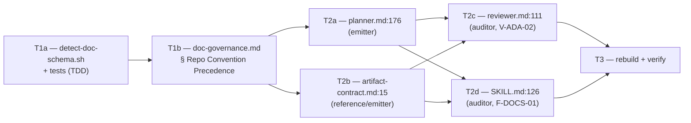

# M1 — Repo-Convention Schema Precedence (ADR-012 E1)

> **Milestone M1** · Wave 1 · Depends on: — · Status: pending
>
>  Detection helper follows the `detect-frontend.sh` / `detect-monorepo.sh` bash precedent (avoids a V-INT-03 third variant).

## Objective

Close ADR-012 E1: make blackhole detect which ADR-artifact schema a consumer repo already
uses — mercure's or blackhole's own — at both artifact layers (`decisions/INDEX.md` table
header, ADR file frontmatter) and emit matching rows/frontmatter, instead of unconditionally
emitting blackhole's fixed 5-column/generic shape. `doc-governance.md` § Repo Convention
Precedence already binds this for frontmatter in spirit but has never had concrete detection
logic; this plan supplies it, extends the rule's scope to the INDEX header, and updates the
four downstream consumers (`planner.md`, `artifact-contract.md`, `reviewer.md`, `SKILL.md`)
so mercure and blackhole can co-exist on one repo without producing incompatible artifacts
(ADR-012 Findings 1–2). Scope is **M1 only** — E2–E5 (design promotion, Active Constraints,
decision-log, autonomy flip) are separate milestones, out of scope here.

Binding constraint from the ADR's Migration Plan step 1 and this milestone's Risk table:
**rule → emitters → auditor**, so the auditor (`reviewer.md`, `SKILL.md`) never rejects a
row a not-yet-updated emitter (`planner.md`) is still producing in the old fixed shape. The
Issue DAG below encodes this as a hard dependency, not just prose guidance.

**Threat Model**: Not required. Internal doc-tooling change (markdown rule files, one
read-only detection script) with no network surface, no auth boundary, no user-data path.

## Touch-Paths

### T1a — `scripts/detect-doc-schema.sh` + `scripts/detect-doc-schema.test.ts` (new, TDD)

The crux of the milestone: concrete, testable detection logic, replacing "detect the schema"
with a deterministic contract. Mirrors the existing `scripts/detect-frontend.sh` /
`scripts/detect-monorepo.sh` sibling pattern exactly (bash, single-line stdout, <500ms,
read-only, no network, exits 0 always) — see § Codebase Conventions and the TypeScript-vs-
prompt recommendation below.

**Contract**: `bash scripts/detect-doc-schema.sh index <path-to-INDEX.md>` and
`bash scripts/detect-doc-schema.sh frontmatter <path-to-ADR-file.md>`, each emitting exactly
one line: `schema=mercure`, `schema=blackhole`, or `schema=ambiguous`.

**`index` mode — what is parsed**: the first markdown table header row in the target file (a
line matching `^\s*\|.*\|\s*$` that appears immediately before a `|---|...` separator line).
Split on `|`, trim whitespace, lowercase each cell.

- Exact match (case-insensitive, order-sensitive) to `["adr", "title", "status", "date"]`
  (mercure, 4 columns, `companion-file-sync.md:45`) → `schema=mercure`.
- Exact match to `["path", "summary", "type", "status", "review_trigger"]` (blackhole, 5
  columns, `decisions/INDEX.md:3`) → `schema=blackhole`.
- Any other outcome — wrong column count, a renamed/extra/missing column, reordered columns,
  or no header row found before EOF — → `schema=ambiguous`. (File-absent is **not** passed to
  the script at all — the caller checks existence first and defaults to blackhole's schema
  directly, no WARN; see T1b.)

**`frontmatter` mode — what is parsed**: the YAML block between the first pair of `---`
lines in the target ADR file, top-level keys only.

- Mercure-only discriminator keys (any present, per `templates/adr-template.md`): `number`,
  `title`, `source`, `scope`, `decision_signals`, `tracking_initiative` → `schema=mercure`.
- Blackhole-only discriminator keys (any present, per `doc-governance.md`'s schema, and none
  of the mercure keys above present): `last_updated`, `review_trigger` → `schema=blackhole`.
- Ambiguous: unparsable YAML; discriminator keys from **both** sets present (hand-mixed
  file); or only the shared keys (`type`, `status`, `created`, `related`, `supersedes`) are
  present with no discriminator from either set → `schema=ambiguous`. (No-ADR-exists-yet is
  likewise a caller-side existence check, not passed to the script — defaults to blackhole,
  no WARN.)

**AC (measurable)**: `bun test scripts/detect-doc-schema.test.ts` starts RED with ≥11 cases
written first — `index` mode: (1) mercure header → mercure, (2) blackhole header → blackhole,
(3) short/missing-column header → ambiguous, (4) header with extra whitespace/case variance
→ still mercure (normalization), (5) reordered columns → ambiguous, (6) no header row in file
→ ambiguous; `frontmatter` mode: (7) mercure-shaped frontmatter → mercure, (8)
blackhole-shaped frontmatter → blackhole, (9) mixed discriminator keys → ambiguous, (10)
only-shared-keys frontmatter → ambiguous, (11) unparsable/missing frontmatter block →
ambiguous; plus (12) a "stdout is exactly one line matching
`schema=(mercure|blackhole|ambiguous)`" contract test in every case, mirroring
`detect-frontend.test.ts`'s final assertion. All 12 pass GREEN after implementation; script
exits 0 in every case.

**Rollback**: delete `scripts/detect-doc-schema.sh` and its test file. Nothing else
references the script until T1b/T2 wire it in, so deletion alone is a complete, clean revert
with zero residual effect.

### T1b — extend `src/references/doc-governance.md` § Repo Convention Precedence

Extend the existing frontmatter-only rule to explicitly cover both artifact layers and wire
in T1a's script as the canonical detection definition — same "cited as cross-reference, not
invoked directly by prose-only consumers" pattern already used for `detect-frontend.sh` in
`reviewer.md:112`.

**AC (measurable)**: § Repo Convention Precedence's body, after edit, contains: (a) an
explicit statement that detection covers both `documentation/decisions/INDEX.md`'s table
header and ADR file frontmatter; (b) a citation of `scripts/detect-doc-schema.sh` as the SSOT
comparison definition (do not restate the column lists/discriminator keys a second time in
this file — point to the script, `V-DRY-01`); (c) the three-outcome contract stated
explicitly: file/ADR absent → blackhole's schema, no `V-INT-01`; header/frontmatter matches
one schema exactly → that schema; `ambiguous` → fall back to blackhole's schema **and** emit
`V-INT-01` WARN citing the offending `file:line`.

**Rollback**: revert this hunk alone. § Repo Convention Precedence reverts to
frontmatter-only scope (today's behavior) even if T1a's script is still present on disk — an
unreferenced script is inert.

### T2a — `src/agents/planner.md:176` (emitter)

Update the design-track promotion step (§4.8, `status: "ready"` branch) to consult T1b's
detection outcome before writing `documentation/decisions/ADR-{NNN}-{slug}.md` and its
`documentation/decisions/INDEX.md` row: emit in the detected schema; on `ambiguous`, emit
blackhole's own schema and include a `V-INT-01` WARN finding in the same worker JSON return.

**AC (measurable)**: §4.8's `ready` branch text names the detection step explicitly (schema
for both the ADR frontmatter and the INDEX row); the existing `status: "ready"`/`"blocked"`
worker-JSON contract is otherwise unchanged (TRANSPARENT per ADR-012's Refactoring Impact
table — no new required field, no renamed field).

**Rollback**: revert this hunk alone. Planner falls back to always emitting blackhole's own
fixed schema (today's behavior) — safe in isolation, since that is also the `ambiguous`/
absent-file fallback this milestone introduces everywhere else.

### T2b — `src/references/artifact-contract.md:15` (reference / emitter-adjacent)

One-line addition to the `design` row of the Route → artifact table: schema (both the INDEX
row shape and the ADR frontmatter shape) follows T1b's repo-convention-precedence detection.
Pointer only — mirrors the existing `worker-schemas.md:244` pointer-sentence convention
(content spec lives in `doc-governance.md`, not duplicated here, `V-DRY-01`).

**AC (measurable)**: the `design` row's cell gains exactly one clause/footnote pointing to
`doc-governance.md` § Repo Convention Precedence; no restatement of column lists or
discriminator keys in this file.

**Rollback**: revert this hunk alone. Purely documentation — zero behavioral effect either
way.

### T2c — `src/agents/reviewer.md:111` (auditor, `V-ADA-02`)

Update the Decisions-index-currency check so it no longer assumes a fixed 5-column row: a
same-diff INDEX row in **either** detected schema (mercure 4-column or blackhole 5-column)
satisfies the check. Only a genuinely missing row — no row referencing the new ADR in either
shape — remains a `V-ADA-02` WARN.

**AC (measurable)**: the `V-ADA-02` bullet's check description explicitly names both
row-shapes as acceptable; a fixture mercure-shaped row (`| ADR-013 | Title | Accepted |
2026-07-21 |`) referencing a same-diff `Accepted` ADR no longer trips `V-ADA-02`.

**Rollback**: revert this hunk alone. Reviewer reverts to auditing only the blackhole
5-column shape. Note (see § Risks R2): reverting this task in isolation is safe; **landing**
it before T2a/T2b is what is unsafe, which is why the DAG below gates it behind both
emitters.

### T2d — `src/SKILL.md:126` (auditor, `F-DOCS-01`, read-only/report-only)

Update the campaign-audit mode's `F-DOCS-01` description so "INDEX.md current" accepts
either detected schema when determining currency. Read-only report path — no merge-blocking
behavior change, only what counts as "current" in the audit report.

**AC (measurable)**: `F-DOCS-01`'s table cell in § Campaign audit mode notes it accepts
either schema; no change to the F-code's severity/blocking semantics (still report-only).

**Rollback**: revert this hunk alone. `F-DOCS-01` is read-only/report-only — reverting only
affects audit-report accuracy on a mercure-shaped repo, never merge-blocking behavior.

### T3 — rebuild + verify

**AC (measurable)**: `bun run build` exits 0 with a clean git diff (`V-BUILD-01`); `bun test`
exits 0, zero failures, including the new `detect-doc-schema.test.ts` suite (T1a); `bun run
verify` exits 0, all checks pass. `EXPECTED_CHECK_COUNT` (`scripts/build.ts:288`, currently
28) stays unchanged — this milestone adds a detection utility, not a new
`scripts/checks/*.check.ts` verify domain. `VCODE_TABLE_ROW_COUNT` (`scripts/build.ts:277`,
currently 46) stays unchanged — no new V-code is introduced; this milestone reuses the
existing `V-INT-01` row.

**Rollback**: N/A — verification step, nothing to revert. A `bun run verify` failure means
fix forward on the specific T1/T2 task it points at; do not merge past a red gate.

## Strategy

TDD-first, bottom-up: the detection primitive (T1a) is built and tested in isolation before
anything depends on it, exactly like `detect-frontend.sh`/`detect-monorepo.sh` were. The rule
file (T1b) is the single place that names the detection contract; every downstream consumer
(T2a–T2d) points at T1b rather than re-describing column lists or discriminator keys inline
— this is the same pointer-sentence discipline already used at `worker-schemas.md:244` and
prevents four independent prose descriptions from drifting apart (`V-INT-03`: a fifth,
sixth, seventh variant of "how do I tell mercure's schema from blackhole's" is exactly the
failure mode this milestone exists to close, not reopen).

Emitters land before the auditor (ADR-012's binding order): `planner.md` (T2a) and
`artifact-contract.md` (T2b) are independent of each other (no shared file) and can run in
parallel once T1b merges. `reviewer.md` (T2c) and `SKILL.md` (T2d) are also independent of
each other but both depend on T2a having landed — auditing a row shape the emitter cannot yet
produce is dead code with no fixture to test against, and (per the ADR's stated rationale)
landing the auditor first risks a live window where a not-yet-updated planner still emits the
old fixed shape while the reviewer has already loosened its check in a way that could mask a
genuine `V-ADA-02` regression on a still-blackhole-only repo. T3 runs last, after all of
T1a/T1b/T2a–d merge.

## Issue DAG

Waves respecting the rule-then-emitters-then-auditor binding order: **W1** T1a → **W2** T1b →
**W3** T2a, T2b (parallel — emitters, no shared file) → **W4** T2c, T2d (parallel — auditors,
no shared file, both gated on both emitters) → **W5** T3.

## Execution Assignments

| Agent | Task(s) | Model | Delegation Contract |
|-------|---------|-------|----------------------|
| blackhole:implementer | T1a | sonnet | **Objective**: write failing tests then implement `scripts/detect-doc-schema.sh` per T1a's 12-case spec. **Output format**: new `scripts/detect-doc-schema.sh` (bash) + new `scripts/detect-doc-schema.test.ts` (bun:test, `spawnSync` pattern matching `detect-frontend.test.ts`). **Scope**: these two new files only, isolated `wt-<issue>` worktree, `blackhole/issue-N` branch. **Tool guidance**: Read `scripts/detect-frontend.sh` and `scripts/detect-frontend.test.ts` first for exact contract/style parity. **Stop condition**: all 12 cases RED before implementation, all GREEN after; `bun test scripts/detect-doc-schema.test.ts` exits 0. |
| blackhole:implementer | T1b | sonnet | **Objective**: extend `src/references/doc-governance.md` § Repo Convention Precedence per T1b's AC. **Output format**: edit to `src/references/doc-governance.md` only. **Scope**: this file only; do not restate T1a's column lists/discriminator keys inline. **Tool guidance**: cite `scripts/detect-doc-schema.sh` the same way `reviewer.md:112` cites `detect-frontend.sh` ("cross-reference, not invoked"). **Stop condition**: three-outcome contract (mercure/blackhole/ambiguous+WARN) stated explicitly; T1a merged first (hard dependency). |
| blackhole:implementer | T2a, T2b | sonnet | **Objective**: update `planner.md:176` and `artifact-contract.md:15` per T2a/T2b's ACs. **Output format**: edits to `src/agents/planner.md` and `src/references/artifact-contract.md`. **Scope**: these two files only; no change to the `ready`/`blocked` worker-JSON contract shape. **Tool guidance**: `artifact-contract.md` gets a pointer sentence only — do not duplicate `doc-governance.md`'s content (`V-DRY-01`). **Stop condition**: both files point at T1b's detection contract; `bun run verify` shows no new `V-DELEG`/tool-policy regressions on either file. |
| blackhole:implementer | T2c, T2d | sonnet | **Objective**: update `reviewer.md:111` (`V-ADA-02`) and `SKILL.md:126` (`F-DOCS-01`) per T2c/T2d's ACs. **Output format**: edits to `src/agents/reviewer.md` and `src/SKILL.md`. **Scope**: these two files only. **Tool guidance**: T2a and T2b must already be merged (DAG dependency) — verify via `git log` before starting. **Stop condition**: `V-ADA-02` and `F-DOCS-01` both accept either detected schema; no severity/blocking-semantics change to either code. |
| blackhole:reviewer | Review of every PR (T1a, T1b, T2a/T2b, T2c/T2d) | sonnet | **Objective**: audit each PR against `blackhole-vcodes.md`, this plan's Touch-Paths, and the binding DAG order. **Output format**: `review-aggregate.ts`-consumed findings JSON per `worker-schemas.md` § Reviewer. **Scope**: read-only — no Write/Edit. **Tool guidance**: spot-check T1a's 12 test cases actually exercise the ambiguous/absent distinction (not just the happy path); on T2c/T2d PRs, confirm T2a/T2b are already merged before approving (DAG-order gate). **Stop condition**: zero CRITICAL/HIGH findings, or explicit user-approved exception. |
| blackhole:implementer | T3 | sonnet | **Objective**: run the full quality gate — `bun run build`, `bun test`, `bun run verify` — per T3's AC. **Output format**: pass/fail report quoting command output (verification-evidence gate). **Scope**: repo root, no edits expected unless a gate fails, in which case fix forward on the specific T1/T2 task. **Tool guidance**: confirm `EXPECTED_CHECK_COUNT` (28) and `VCODE_TABLE_ROW_COUNT` (46) are unchanged — a diff on either means an unplanned scope addition crept in. **Stop condition**: all three commands exit 0; both ground-truth counters unchanged. |

**Parallelization**: W3 (T2a, T2b) and W4 (T2c, T2d) each run as two-agent parallel batches
with no file overlap within the wave; the wave boundary itself (W3 fully merged before W4
starts) is the binding-order gate and is **not** parallelized across.

## Codebase Conventions

| Touchpoint | Convention | Source | Required by |
|------------|------------|--------|--------------|
| Detection-utility shape | Bash script, single-line `key=value` stdout, <500ms, read-only, no network, exits 0 always | `scripts/detect-frontend.sh`, `scripts/detect-monorepo.sh` | V-INT-01/03 — T1a follows this exactly rather than introducing a third detection-utility shape |
| Cited-not-invoked SSOT pattern | Prose-only consumers (reviewer, audit-mode) cite the detection script as the keyword/comparison SSOT instead of restating its logic or shelling out | `src/agents/reviewer.md:112` (V-ADA-04 keyword SSOT), `scripts/detect-frontend.sh` header comment | V-INT-01/03 — T1b, T2c, T2d |
| Pointer-sentence convention | One sentence pointing to another file's content spec, no duplication | `src/references/worker-schemas.md:244` | V-DRY-01 — T2b |
| INDEX row schemas (both, frozen) | mercure `\| ADR \| Title \| Status \| Date \|`; blackhole `\| path \| summary \| type \| status \| review_trigger \|` | `companion-file-sync.md:45` (mercure); `documentation/decisions/INDEX.md:3` (blackhole) | V-INT-01 — T1a's `index` mode comparison set |
| ADR frontmatter schemas (both, frozen) | mercure: `type, number, title, status, created, supersedes, related, source, scope, decision_signals, tracking_initiative`; blackhole: `type, status, created, last_updated, review_trigger, related, supersedes` | `templates/adr-template.md` (mercure); `src/references/doc-governance.md` (blackhole) | V-INT-01 — T1a's `frontmatter` mode discriminator keys |
| Bun test harness | `import { describe, expect, test } from 'bun:test'`, `spawnSync` against the script path, `fs.mkdtempSync` fixture dirs, cleanup in `finally` | `scripts/detect-frontend.test.ts` | T1a |
| State-mutation write protocol | `.tmp` + `mv` atomic writes (not applicable here — T1/T2 touch only tracked `src/` prose/script files, no `.blackhole/` state mutation) | `blackhole-state.md` | N/A for this milestone — noted for completeness |

## Risks

| Risk | Severity | Mitigation |
|------|----------|------------|
| Schema detection misfires on a malformed/partial INDEX header (ADR-012 R6) | Low | T1a's `ambiguous` outcome + T1b's fallback-and-`V-INT-01`-WARN rule make the misfire visible rather than silent, exactly as ADR-012 R6 mandates |
| Auditor (T2c/T2d) lands before emitters (T2a/T2b) — a live window where the reviewer accepts a row shape the planner cannot yet produce, or a real regression on a still-blackhole-only repo goes unflagged | Medium | Issue DAG makes T2c/T2d structurally depend on both T2a and T2b; `blackhole:reviewer`'s delegation contract explicitly checks merge order via `git log` before approving a T2c/T2d PR |
| Detection discriminator keys drift from the two source templates over time (e.g. a future mercure release renames `number`) | Low | § Codebase Conventions cites the exact frozen source files (`templates/adr-template.md`, `companion-file-sync.md:45`); T1a's test fixtures are pinned to those snapshots, so a future template change surfaces as a failing test, not silent drift |
| A future contributor registers `detect-doc-schema.sh` as a new `scripts/checks/*.check.ts` verify domain without bumping `EXPECTED_CHECK_COUNT` | Low | T3's AC explicitly confirms the counter is unchanged by *this* milestone; noted here as a forward-looking flag for whoever does add such a check later |
| Consumers updated before the rule exists (ADR-012's own risk table) | Low | Binding order in the Issue DAG: T1a → T1b gates everything else; no T2 task can start before T1b merges |

## References

- **ADR**: `documentation/decisions/ADR-012-shared-artifact-substrate.md` — Decision E1;
  Refactoring Impact row for `doc-governance.md` precedence rule (DEPRECATION for the four
  named consumers); Risk R6
- **Milestone**: `documentation/milestones/_active/companion-substrate-closure/milestone-1.md`
  — T1–T3, Touch-paths, Risks, Rollback
