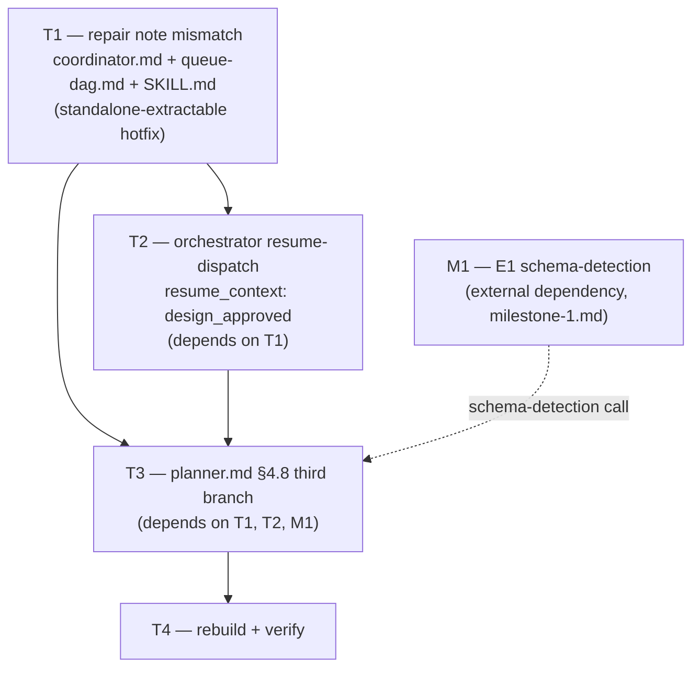

# Plan — M2: human-approved promotion path (ADR-012 E2)

> **Milestone M2** · Wave 2 · Depends on: M1 · Status: pending
>
>  **T1 fixes a live bug** (design-track blocks never resume: `awaiting-design-approval` unrecognised by coordinator.md/queue-dag.md/SKILL.md) and is extractable as a standalone hotfix. Binding: the planner never computes its own design-autonomy verdict (ADR-010).


## Objective

Close ADR-012's E2 gap: a design a human explicitly approves currently dies in gitignored
`.blackhole/plans/issue-N-design.md` because `planner.md` §4.8 is a binary (`ready` →
promote / `blocked` → return) with no branch a human approval can reach — and the
resumption path that would even get there is broken by a note-value mismatch
(`phase-plan.md` sets `notes: awaiting-design-approval`; `coordinator.md:185` and
`queue-dag.md:39` don't recognize it, so a design-track block never resumes).

Four tasks, strictly ordered because each depends on the one before it reaching a live
state:

1. **T1** — repair the note mismatch (live bug fix, standalone-extractable)
2. **T2** — orchestrator re-spawns the planner with an explicit `resume_context:
   design_approved` directive (depends on T1)
3. **T3** — `planner.md` §4.8 gains a third branch that promotes the approved design
   verbatim (depends on T1, T2, and M1's schema-detection machinery)
4. **T4** — rebuild + verify

**Binding constraint (ADR-010, restated for this milestone)**: the planner must never
compute its own design-autonomy verdict. T3's third branch fires *only* on an explicit
`resume_context: design_approved` directive supplied by the orchestrator — itself
downstream of a *human's* response, relayed by the coordinator. The branch does not
re-read, re-score, or re-judge the design note's substance; it promotes the file
byte-for-byte. See § Binding Constraint Verification below for how this is enforced and
checked.

## Touch-Paths

- `src/agents/coordinator.md` (T1)
- `src/references/queue-dag.md` (T1)
- `src/agents/orchestrator.md` (T2)
- `src/agents/planner.md` (T3)

No other files. `src/SKILL.md` is a **discovered fifth touchpoint** — see § T1 finding
below — folded into T1's scope because it is the same class of edit (recognized-notes
documentation), not a new touch-path.

## Strategy

### T1 finding — is it safely extractable as a standalone hotfix? **Yes.**

Verified against the actual files (not just the milestone doc's claim):

- `src/references/phase-plan.md:21` already writes `notes: awaiting-design-approval` on
  `track: design` blocked returns (`failing_checks` includes `design_pending_approval`).
  This is **pre-existing production behavior on `main` today** — confirmed live, not
  hypothetical.
- `src/agents/coordinator.md:185` (Chat Feedback Intake Protocol § Resolving Blockers)
  recognizes only `awaiting-user-clarification`, `awaiting-plan-approval`, and
  `merge-order cycle with #N`. `awaiting-design-approval` is absent — a design-track
  block is **never** recognized, so the coordinator never parses the user's approval and
  never resumes the orchestrator.
- `src/references/queue-dag.md:39` documents the `notes` field with `e.g.` examples that
  also omit `awaiting-design-approval`.

T1 touches only `coordinator.md`'s recognized-notes list and `queue-dag.md`'s enum
documentation — a closed, 2-file diff with zero dependency on E1 (M1) or on T2/T3's new
branches. It repairs behavior that is broken **today**, independent of whether M1 or the
rest of M2 ever lands. **Confirmed safely extractable** as a standalone hotfix per the
milestone doc's own framing.

### T1 — full consumer sweep of the `notes` enum (ADR-012 R9)

Grepped `awaiting-user-clarification|awaiting-plan-approval|awaiting-design-approval`
across `src/` before landing, per R9's explicit mandate. Results, classified by whether
they require an edit:

| File:line | Role | Needs edit? |
|---|---|---|
| `src/agents/coordinator.md:185` | Recognized blocked-notes gate — parses user response, resumes orchestrator | **Yes** — add `awaiting-design-approval` |
| `src/references/queue-dag.md:39` | Schema documentation (`notes` field `e.g.` list) | **Yes** — add `awaiting-design-approval` |
| `src/references/phase-plan.md:21` | Writer — already emits the note | No — already correct, this is the source of truth for the value |
| `src/SKILL.md:95` | Orchestrator's own "do not spawn implement while blocked with `awaiting-user-clarification` or `awaiting-plan-approval`" gate | **Yes** — same class of recognized-notes gate as `coordinator.md:185`; a design-track block left off this list is a latent parallel gap of the same shape R9 warns about. Folded into T1 for consistency, even though the milestone doc names only 3 consumers |
| `src/agents/orchestrator.md:356-357` | Restates the blocker-gate rule (`awaiting-user-clarification`, `awaiting-plan-approval`) | No — descriptive prose about the *existing* two gates it already spawns for; does not enumerate the full notes space and doesn't need to, since T2's new resume-dispatch section (below) is the actual mechanism that reacts to `design_approved` |
| `src/references/clarify-gates.md:47` | Illustrative JSON snippet: `"awaiting-user-clarification \| awaiting-po-sign-off \| awaiting-plan-approval"` | No — different value set (includes `awaiting-po-sign-off`, which isn't in `queue-dag.md`'s enum either); pre-existing documentation drift orthogonal to this milestone's scope, not introduced or worsened by this change |
| `src/references/worker-schemas.md:57` (`campaign-resume-signal.ts` resume gate) | `"No user gate: no issue notes matching awaiting-user, awaiting-plan, or awaiting-design ..."` | No — **verified already safe**: this is a *prefix* match (`awaiting-design`), which already covers `awaiting-design-approval` without modification |

Net: T1's edit surface is `coordinator.md` + `queue-dag.md` + `SKILL.md` (3 files, all
additive documentation/recognition-list changes).

### T2 — orchestrator spawn directive, respecting V-CONTENTGATE-01

`src/agents/orchestrator.md`'s `## 5-Field Delegation Contract` section is baselined at
131 LOC in `ORCHESTRATOR_CONTENT_GATE_BASELINE` (`scripts/checks/core.check.ts:766`) —
**grow-never**, and it is already at its ceiling. No edit may touch that section.

Discovery note (recorded for transparency, not adopted): the existing `## Design
Autonomy Dispatch (ADR-010 D4)` section (orchestrator.md:411-433, 23 LOC) is *not* in the
baseline map, so mechanically the content-gate check would tolerate inline growth there
up to its 50-LOC new-section budget. The task brief is explicit, however, that the
`resume_context: design_approved` dispatch logic must land in a **new** `##` section, not
inline growth of an existing one — followed literally here, both because it is the
binding instruction and because it keeps the pre-existing D4 section's diff-reviewability
intact (a reviewer diffing this PR sees one net-new section, not a modified one).

**Implementation**:
- Add a new section, `## Design-Approval Resume Dispatch (ADR-012 E2.3)`, immediately
  after `## Design Autonomy Dispatch (ADR-010 D4)` (before `## Kaizen hunt dispatch`).
  Content (target ≤30 LOC, hard ceiling 50 LOC per `CONTENT_GATE_NEW_SECTION_BUDGET_LOC`):
  - Trigger: coordinator resumes the orchestrator (`interrupt: false`) after clearing
    `status: blocked` / `notes: awaiting-design-approval` on a `track: design` issue
    (T1's repaired path).
  - Action: re-spawn `planner` with an explicit `resume_context: design_approved`
    directive — never a generic re-spawn (a generic re-spawn would re-run the whole
    Design Track including two fresh blind-critic invocations, discarding the artifact
    the human actually reviewed).
  - Directive provenance: `resume_context: design_approved` is set by the orchestrator
    **only** in direct response to the coordinator's resume signal, which is itself
    downstream of the human's parsed approval (`coordinator.md` § Resolving Blockers,
    T1's newly-recognized note). The orchestrator does not infer this directive from
    design-note content — it is a pass-through of the human verdict, following the same
    explicit-directive-only convention ADR-004 established for `track: design` /
    `track: brainstorm`.
- Add a **one-line pointer** at the end of the existing `## Design Autonomy Dispatch
  (ADR-010 D4)` section: "Resume-after-human-approval dispatch (`resume_context:
  design_approved`) is a distinct contract — see § Design-Approval Resume Dispatch
  below." This is the "one-line pointer" the task brief requires; it adds 1 LOC to a
  non-baselined section already well under its 50-LOC budget (23 → 24 LOC), so it does
  not trip V-CONTENTGATE-01 either.
- **Preserving V-DESIGN-02**: `scripts/checks/design-track.check.ts`'s
  `ORCHESTRATOR_DESIGN_GATE_REQUIRED_MARKERS` requires the literal substring "applies
  only the worker JSON's \`status\` field" to remain present in `orchestrator.md`
  (currently at line 423, inside `## Design Autonomy Dispatch`). T2's edit is purely
  additive (new section + one-line pointer appended to the *end* of the existing
  section) and does not touch lines 411-431 where that marker lives — verified by re-run
  of `bun run verify` after the edit (T4).

### T3 — `planner.md` §4.8 third branch, respecting V-DESIGN-01/02

`scripts/checks/design-track.check.ts`'s `DESIGN_TRACK_REQUIRED_HEADINGS` requires all 8
Design Track headings (`## Requirements Framing` … `## Gate`) to remain present verbatim.
T3 edits *inside* the existing `## Gate` subsection (planner.md §4.8, ~lines 168-186) —
no heading is added, removed, or renamed, so V-DESIGN-01 is structurally unaffected by
construction.

`PLANNER_DESIGN_GATE_REQUIRED_MARKERS` requires the literal substrings
`design-aggregate.ts` and `MUST NOT substitute its own judgment` to remain present
(currently lines 170 and 173). T3 adds a third branch *after* the existing
`ready`/`blocked` branches — both markers stay exactly where they are; the diff appends,
it does not rewrite the surrounding prose.

**Implementation** — new third branch in §4.8's `## Gate` subsection, guarded on the
directive from T2, never on artifact content:

```
- `resume_context: design_approved` (from an explicit orchestrator directive — never
  self-selected, never inferred from `design-aggregate.ts` or from re-reading the design
  note's substance) → promote the on-disk `.blackhole/plans/issue-N-design.md`
  **verbatim**: no re-analysis, no re-invocation of `design-aggregate.ts`, **no
  blind-critic re-spawn**. Write:
  - `documentation/decisions/ADR-{NNN}-{slug}.md` — frontmatter shaped per M1/E1's
    detected-schema precedence (`doc-governance.md` § Repo Convention Precedence,
    extended by M1 to also cover ADR frontmatter — **hard dependency on M1 landing
    first**, since the schema-detection call this branch makes does not exist before M1)
  - a matching `documentation/decisions/INDEX.md` row, same E1-detected schema
  - both committed inside the issue's own PR — no orchestrator file write (orchestrator
    is `disallowedTools: [Write, Edit, Delete]`), no draft/final flip; merge is the
    approval, matching `artifact-contract.md` § Delivery mechanism and ADR-010 D5.
  - Return `status: "ready"`, `track: "design"` in the worker JSON — identical shape to
    the existing autonomous-`ready` return, so no downstream consumer (`worker-schemas.md`
    validator, `phase-plan.md` gate table) needs a new case.
```

The `ready`/`blocked` branches are untouched — same code paths, same conditions, same
returns. The third branch is purely additive, guarded on a directive field
(`resume_context`) that is orthogonal to the `design-aggregate.ts`-derived `status` field
the existing two branches key off of.

### Binding Constraint Verification (ADR-010 — planner never self-grades)

The plan must show the planner cannot infer approval from artifact substance. Three
independent structural guarantees, not just a stated intent:

1. **Guard condition is a directive field, not a content read.** The third branch's
   trigger is `resume_context: design_approved` — a field the orchestrator sets on the
   spawn prompt, never something the planner derives by reading
   `.blackhole/plans/issue-N-design.md`'s contents. The planner has no code path in this
   branch that inspects the design note's text to decide whether to promote; it only
   checks which directive it was spawned with (same pattern as `track: design` /
   `track: brainstorm` — ADR-004's explicit-directive-only convention, cited directly in
   T2/T3's task text).
2. **The directive's provenance chain is human-gated, not planner-gated.** Directive
   value traces back through: orchestrator (T2, new section) ← coordinator resume,
   triggered only after parsing an explicit user response to the (now-recognized, T1)
   `awaiting-design-approval` block ← the human. No hop in this chain is the planner
   itself judging the design.
3. **No re-invocation of `design-aggregate.ts` on this branch.** The autonomous `ready`
   path's verdict comes from the deterministic script; T3's human-approved path
   deliberately does **not** call it again — promoting verbatim, not re-scoring. This is
   the explicit anti-pattern ADR-012's Finding 3b analysis warns against ("a generic
   re-spawn would re-run the entire Design Track... discarding the artifact the human
   actually reviewed") and it is also why this branch cannot degrade into
   "self-graded homework": there is no verdict computation in this branch at all, only a
   file copy gated on an external directive.

Any implementation that instead checks "is this design note well-formed / high quality /
complete" before promoting on `resume_context: design_approved` would violate this
constraint — flagged here so review can check for it directly in the diff.

## Issue DAG



Binding order: **T1 first — nothing else is reachable without it.** T2 and T3 both
consume T1's repaired resumption path (T2's new dispatch section only fires once the
coordinator can actually resume the orchestrator on this note; T3's branch is dead code
until something can spawn `resume_context: design_approved`, which is T2). T3 additionally
depends on M1 for the schema-detection call it makes when writing the ADR/INDEX row.

## Execution Assignments

| Task | Agent | Model | Notes |
|---|---|---|---|
| T1 — note mismatch repair | `general-purpose` subagent | sonnet | 3-file, additive-only diff; no test infra changes needed beyond existing `verify` checks |
| T2 — orchestrator resume dispatch | `general-purpose` subagent | sonnet | Must re-run `bun run verify` locally after edit to confirm V-CONTENTGATE-01 and V-DESIGN-02 stay green before handing to T3 |
| T3 — planner.md third branch | `general-purpose` subagent | sonnet | Depends on M1 having landed; must re-run `bun run verify` locally to confirm V-DESIGN-01/02 stay green |
| T4 — rebuild + verify | `general-purpose` subagent | sonnet | `bun run build` then `bun run verify` (28 checks) then `bun test`; report full output, not just exit code |
| Review pass (all tasks) | x-reviewer | sonnet (quality mode) | Focus: V-DESIGN-01/02, V-CONTENTGATE-01, ADR-010 self-grading constraint (§ Binding Constraint Verification above) |

## Codebase Conventions

| Touchpoint | Convention | Source |
|---|---|---|
| `notes` enum values | Documented as free-text `e.g.` examples in `queue-dag.md`, not a closed TypeScript enum — additive values need no schema migration, only documentation + the consuming gate's recognition list | `src/references/queue-dag.md:39` |
| Explicit-directive-only track/resume dispatch | New track or resume-mode branches are gated on an explicit orchestrator-supplied directive field, never self-selected from issue/artifact content, matching `track: design` / `track: brainstorm` | ADR-004; `src/agents/orchestrator.md` § Route-derived dispatch step 4 |
| `orchestrator.md` section growth | Baselined sections (`ORCHESTRATOR_CONTENT_GATE_BASELINE`) are grow-never; new sections are capped at 50 LOC (`CONTENT_GATE_NEW_SECTION_BUDGET_LOC`) | `scripts/checks/core.check.ts:729-814` (V-CONTENTGATE-01) |
| Design Track template integrity | All 8 `## `-level Design Track headings and both gate markers (`design-aggregate.ts`, "MUST NOT substitute its own judgment") must remain present in `planner.md`; the orchestrator marker ("applies only the worker JSON's `status` field") must remain present in `orchestrator.md` | `scripts/checks/design-track.check.ts` (V-DESIGN-01/02) |
| Promotion delivery mechanism | Pre-merge write inside the issue's own PR; merge = approval; no orchestrator file write, no draft/final flip | `src/references/artifact-contract.md` § Delivery mechanism; ADR-010 D5 |
| Single-writer invariant | Not applicable to T2/T3 directly (queue/ledger untouched by this milestone) — noted for completeness since `orchestrator.md` is the file being edited | `blackhole-state.md` § Single-writer invariant |

## Risks

| Risk | Impact | Mitigation | Task |
|---|---|---|---|
| Note repair misses another enum consumer (ADR-012 R9) | Medium | Full grep sweep performed in § Strategy above; 3 edit-needing consumers identified (`coordinator.md`, `queue-dag.md`, `SKILL.md`), 4 verified-safe consumers documented with reasoning | T1 |
| `orchestrator.md` growth trips V-CONTENTGATE-01 | High (blocks `bun run verify`) | New section capped at ≤30 LOC target / 50 LOC hard ceiling; one-line pointer only in the existing D4 section; `## 5-Field Delegation Contract` untouched | T2 |
| V-DESIGN-01/02 markers accidentally stripped or reworded during edit | High (blocks `bun run verify`) | Both edits are pure appends after the markers' existing lines, not rewrites of surrounding prose; `bun run verify` re-run locally before task handoff (not deferred to T4 alone) | T2, T3 |
| Planner's third branch drifts toward inferring approval from artifact content (self-graded homework) | High (violates ADR-010 binding constraint) | Guard condition is a directive field only, never a content read (§ Binding Constraint Verification); reviewer checklist explicitly checks for this anti-pattern | T3 |
| T3 lands before M1's schema-detection function exists | Medium (broken build / undefined reference) | DAG makes M1 an explicit prerequisite; T3's implementer confirms `doc-governance.md`'s extended precedence rule is present on the branch before writing the promotion call | T3 |
| Promotion writes an ADR the user did not intend (ADR-012 R7) | Low | Fires only on the explicit `resume_context: design_approved` path, itself gated on human approval; artifact is reviewable in the PR before merge | T3 |

## Acceptance Criteria and Rollback (per task)

**T1 — repair the note mismatch**
- AC: `awaiting-design-approval` appears in `coordinator.md`'s recognized blocked-notes
  set, `queue-dag.md`'s `notes` field documentation, and `SKILL.md`'s "do not spawn
  implement while blocked" list. A `track: design` block set to
  `notes: awaiting-design-approval` is recognized by the coordinator's § Resolving
  Blockers logic and the coordinator resumes the orchestrator (`interrupt: false`) after
  parsing the user's response.
- Rollback: pure repair, additive-only across 3 files; reverting restores today's
  (broken) behavior with no side effects — no rollback hazard.

**T2 — orchestrator spawn directive**
- AC: a new `## Design-Approval Resume Dispatch (ADR-012 E2.3)` section exists in
  `orchestrator.md`, ≤50 LOC; a one-line pointer exists at the end of `## Design
  Autonomy Dispatch (ADR-010 D4)`; `bun run verify`'s V-CONTENTGATE-01 and V-DESIGN-02
  checks pass; the directive `resume_context: design_approved` is never self-selected
  by the orchestrator — it fires only downstream of a coordinator resume signal that
  itself required a parsed human response.
- Rollback: the new section and pointer line are additive; removing both restores
  today's `## Design Autonomy Dispatch` section byte-for-byte.

**T3 — `planner.md` §4.8 third branch**
- AC: existing `ready` and `blocked` branch behavior is unchanged (same conditions, same
  returns — verified by diff review, not just by test pass); a `resume_context:
  design_approved` spawn produces a committed `documentation/decisions/ADR-{NNN}-{slug}.md`
  + matching INDEX row inside the issue's own PR, with no `design-aggregate.ts`
  re-invocation and no blind-critic re-spawn; `bun run verify`'s V-DESIGN-01 and
  V-DESIGN-02 checks pass.
- Rollback: the third branch is additive — removing it restores today's binary
  (`ready`/`blocked` only), per ADR-012's own stated rollback note.

**T4 — rebuild + verify**
- AC: `bun run build` succeeds; `bun run verify` reports all 28 checks green (explicit
  focus: V-CONTENTGATE-01, V-DESIGN-01, V-DESIGN-02); `bun test` passes in full.
- Rollback: N/A — verification-only task, no source changes.

## References

- **ADR**: `documentation/decisions/ADR-012-shared-artifact-substrate.md` — chosen
  approach: explicit `resume_context` directive + verbatim promotion (E2, Decision
  section); rejected: generic planner re-spawn (discards the human-reviewed artifact,
  re-runs two blind critics)
- `documentation/milestones/_active/companion-substrate-closure/milestone-2.md` — source
  task spec (T1-T4)
- `documentation/milestones/_active/companion-substrate-closure/milestone-1.md` — M1
  dependency (E1 schema-detection, hard prerequisite for T3)
- `scripts/checks/design-track.check.ts` — V-DESIGN-01/02 enforcement source
- `scripts/checks/core.check.ts:729-814` — V-CONTENTGATE-01 enforcement source
