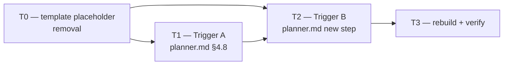

# M3 — `## Active Constraints` Write Path (ADR-012 E3)

> **Milestone M3** · Wave 3 · Depends on: M2 · Status: pending
>
>  Trigger B (analyze-note seeding) is **mandatory** — the only path reaching Active Constraints on a Quick-track-only repo.


## Objective

Close ADR-012 E3: give `ARCHITECTURE.md`'s `## Active Constraints` section its first-ever
writer. Today bootstrap creates the placeholder block and nothing ever fills it — this repo's
own `ARCHITECTURE.md:296-307` carries five load-bearing, hand-written constraints; blackhole
grants consumer repos none of that. Two independent triggers close the gap:

- **Trigger A** — the planner appends a constraint on ADR promotion, when the promoted ADR
  establishes a cross-cutting non-negotiable (same PR/commit as the existing `V-ADA-02`
  INDEX-row append, `planner.md` §4.8's `status: "ready"` branch, landed by M2 T3).
- **Trigger B** — the planner **mandatorily seeds** Active Constraints from an existing
  `investigator` `analyze` note, independent of which track the plan resolves to. This is
  the only path that reaches Active Constraints on a repo whose issues all route to Quick
  track (ADR-012 R3) — Trigger A is unreachable there because no ADR is ever promoted.

**Actor and timing, and why**: both triggers fire from the **planner**, in the same turn and
same commit as the event that triggers them — never a post-merge hook. No agent process exists
at merge time in blackhole's architecture: workers run inside ephemeral worktrees tied to an
open PR, and merge is just a forge state transition with no attached compute. ADR-010's
"merge = approval" pattern (already the delivery mechanism for E2's ADR promotion) requires the
artifact to be complete and correct *before* merge — there is no later point at which a writer
could run. Both triggers therefore write `ARCHITECTURE.md` pre-merge, inside the same diff as
the event that justified the write.

**Ordering consequence** (from the milestone spec): this is the *write* path only. The *read*
path — injecting Active Constraints into worker context — stays Future Work per ADR-012's three
named prerequisites (undecidable relevance, no propagation gate, untrusted-content doctrine).
Pushing content into a section nothing yet reads is safe; pushing malformed or ambiguous content
into a section a future read-path *will* read is the risk this plan actively designs against
(R2 below).

**Threat Model**: Not required (Standard track). Internal doc-tooling change — markdown/prompt
text edits to `planner.md` and a template file — no network surface, no auth boundary, no
user-data path.

## Touch-Paths

### T0 — `templates/companion-files/ARCHITECTURE.md.template` — remove ambiguous placeholder bullets

**Why this task exists**: the live template's `## Active Constraints` scaffold
(`templates/companion-files/ARCHITECTURE.md.template:199-208`) puts its two illustrative
examples as literal bullet-list items outside the HTML comment:

```
- {e.g. "No external state — all persistence goes through the repository layer"}
- {e.g. "Offline-first — every feature must work without network after initial sync"}
```

Trigger B's AC (below) requires detecting "an empty Active Constraints section." A naive
line-count or bullet-count check would see these two lines and conclude the section is already
populated on every freshly-bootstrapped consumer repo — permanently disabling Trigger B. The
`{e.g. "..."}` bullets must never be mistaken for real content.

**Change**: move both examples inside the existing `<!-- -->` comment block (or fold them into
one comment sentence — implementer's choice, either satisfies the AC), leaving the section body
between the heading and the next `## ` heading genuinely empty until a real writer populates it.
Also append one sentence to the comment documenting the attribution convention T1/T2 introduce
(`(ADR-{NNN})` / `(analyze: issue #N)` suffixes) so a human reading a freshly-bootstrapped
template understands what future machine-written bullets will look like.

**AC (measurable)**: `grep -E '^\s*-\s*\{e\.g\.' templates/companion-files/ARCHITECTURE.md.template`
between the `## Active Constraints` heading and the next `## ` heading returns zero matches
outside the `<!-- -->` block; the section still renders as valid Markdown (heading, comment,
horizontal rule, no dangling list syntax).

**Rollback**: revert this hunk alone. Bootstrap reverts to emitting the old two-bullet
placeholder (today's behavior) — harmless in isolation since nothing reads emptiness until T2
lands; T1/T2 simply lose their emptiness-detection precondition if reverted after landing (see
their own rollback notes).

### T1 — Trigger A: `src/agents/planner.md` §4.8 `status: "ready"` branch (~line 175-179)

Extends the promotion step M2 T3 already lands (`planner.md` §4.8, the `status: "ready"`
branch that writes `documentation/decisions/ADR-{NNN}-{slug}.md` + the INDEX row). After that
write, in the **same PR/commit**: apply the **Cross-Cutting Heuristic** (see § Strategy) to the
ADR's Decision section. On a qualifying score, append one bullet to `ARCHITECTURE.md`
`## Active Constraints`:

```
- {constraint, one sentence, imperative} (ADR-{NNN})
```

The `(ADR-{NNN})` attribution suffix is mandatory — it is this task's primary contribution to
R2 (pollution) mitigation: every machine-written bullet is traceable to the ADR that justified
it, so a human pruning the section later has a citation to check, not bare prose to
second-guess.

**AC (measurable)**:
- Fixture ADR whose Decision text states a repo-wide prohibition scored ≥2/3 on the Heuristic
  (e.g. "no direct DB access outside the repository layer, enforced by lint rule X") produces
  exactly one new `ARCHITECTURE.md` bullet citing the ADR number, committed in the same diff as
  the ADR file and INDEX row.
- Fixture ADR describing a single-file, single-component decision scored ≤1/3 (e.g. "rename
  `parseInput()` to `validateInput()`") produces **zero** new bullets.
- The existing `status: "ready"`/`status: "blocked"` worker-JSON contract is unchanged — no new
  required field (TRANSPARENT per ADR-012's Refactoring Impact table row for this interface).

**Rollback**: revert this hunk alone. Promotion reverts to ADR + INDEX row only (M2's landed
behavior) — `## Active Constraints` stays whatever T0/T2 left it; no partial-write hazard since
this task only ever appends after the ADR file write already succeeded.

### T2 — Trigger B: `src/agents/planner.md` — new track-independent workflow step

**Placement — this is the crux of why R3 is actually closed.** Trigger B must **not** hang off
the Standard Track's `[Standard Only]`-gated Codebase Conventions bullet
(`planner.md:68-76`, which already consumes the same `plans/issue-N-analysis.md` note) — that
gate is exactly why ADR-012's Future-Work discussion calls planner-mediated injection
"silently no-ops on Quick track." Add a new, track-independent numbered step to the top-level
**Workflow & Planning Steps** list (near Step 3 "Analyze Codebase," before Step 6 "Generate
Plan Sections"), worded:

> **Seed Active Constraints from analyze note.** When `plans/issue-N-analysis.md` exists, the
> planner **seeds** `ARCHITECTURE.md` `## Active Constraints` from its Architecture Coherence
> findings — this runs regardless of which track (Quick, Standard, Design, Brainstorm) the plan
> resolves to, because it is the only path that reaches Active Constraints on a repo whose
> issues all route to Quick track. **Skip Track is the sole exception**, consistent with Step 3's
> existing "no codebase analysis" carve-out for that track.

The word **"seeds"** is mandatory in this step's text — the milestone spec is explicit that
"may seed" would make the only Quick-track-reachable path optional, defeating its purpose.

**Behavior**: for each finding in the note's Architecture Coherence section, apply the same
Cross-Cutting Heuristic as T1. For each qualifying finding:
1. **Empty-section case** (post-T0, section has zero bullets): append
   `- {constraint} (analyze: issue #N)` unconditionally.
2. **Non-empty-section case** (Trigger A already populated it, or a prior Trigger B run did):
   check for a near-duplicate first — same citation already present, or ≥80% text overlap with
   an existing bullet — and skip if found. This is the dedup half of R2 mitigation: repeated
   analyze notes across a long Quick-track-only campaign must not pile up redundant bullets.

**AC (measurable)**:
- Given a fixture `plans/issue-42-analysis.md` with one Architecture Coherence finding scoring
  ≥2/3 on the Heuristic, and `ARCHITECTURE.md`'s Active Constraints section empty (post-T0
  template), the planner's output for issue 42 includes the corresponding bullet in the same
  PR — **and this holds whether issue 42 resolves to Quick or Standard track**, verified by
  running the fixture through both track branches.
- The new step's text contains the literal word "seeds" and does not contain the string "may
  seed" anywhere in `planner.md`.
- Re-running the same fixture note against an `ARCHITECTURE.md` that already carries the
  identical bullet (dedup case) produces zero additional bullets.

**Rollback**: revert this hunk alone. Quick-track-only repos with no design-track ADR
promotions have Active Constraints stay empty indefinitely — this is the pre-M3 total-gap
behavior, and is explicitly the condition the Metric Qualification (milestone-3.md, ADR-012)
already documents as "the metric does not apply," not a new regression.

### T3 — rebuild + verify

**AC (measurable)**: `bun run build` exits 0 with a clean git diff (`V-BUILD-01`); `bun test`
exits 0, zero failures; `bun run verify` exits 0, all checks pass. `EXPECTED_CHECK_COUNT` and
`VCODE_TABLE_ROW_COUNT` (`scripts/build.ts`) are unchanged — this milestone reuses the existing
`V-INT-01` code for ambiguity flags (Heuristic score of exactly the boundary case, or a
malformed analyze note) and introduces no new verify domain or V-code.

**Rollback**: N/A — verification step. A red gate means fix forward on the specific T0/T1/T2
task it points at; do not merge past it.

## Strategy

### The Cross-Cutting Heuristic (the hardest unsolved part of this milestone)

ADR-012 R1 is explicit: there is no mechanical test for "cross-cutting non-negotiable." This
plan does not invent one — it supplies a 3-question heuristic checklist for the planner prompt,
grounded in this repo's own populated section as the positive exemplar, with a negative
counter-example for contrast. It reduces a judgement call to three yes/no questions instead of
leaving it as an unguided "when the ADR establishes a cross-cutting non-negotiable."

1. **Breadth** — Does the constraint govern ≥2 independent subsystems/modules/agents, not one
   file or one feature?
2. **Enforcement stakes** — Would violating it corrupt shared state, break a protocol
   invariant, or trigger an existing BLOCK-severity V-code — not merely a style/readability
   preference?
3. **Foreclosure** — Does it rule out an entire *category* of future implementation approaches
   for that surface, rather than prescribing today's preferred implementation detail?

**Score ≥2/3 YES → promote to Active Constraints. ≤1/3 → local convention; leave it in the ADR's
own Decision text (T1) or the plan's Codebase Conventions row (T2) — do not append.**

**Worked examples, from this repo's own `ARCHITECTURE.md:296-307` (the exemplar the milestone
spec names):**

| Candidate | Breadth | Enforcement | Foreclosure | Score | Verdict |
|---|---|---|---|---|---|
| "`src/` is the only editable source; every platform tree is a build output" | Y — every platform target | Y — CI blocks drift | Y — rules out ever hand-editing a compiled dir | 3/3 | **Promote** |
| "No direct commits/force-pushes to main/master/release/*" | Y — every worker, every branch | Y — `V-BRANCH-01/02` BLOCK | Y — rules out any direct-commit workflow variant | 3/3 | **Promote** |
| "Every PR must link its issue (`Closes #N`)" | Y — every PR, every worker | Y — `V-GIT-01` BLOCK | Y — rules out any unlinked-merge path | 3/3 | **Promote** |

**Negative counter-example (should NOT promote), drawn from M1's own landed convention:**

| Candidate | Breadth | Enforcement | Foreclosure | Score | Verdict |
|---|---|---|---|---|---|
| "`detect-doc-schema.sh` emits single-line `key=value` stdout, mirroring `detect-frontend.sh`" | N — governs 1-2 detection scripts | N — violating it breaks a style match, not shared state | N — doesn't rule out other detection approaches globally, only for these scripts | 0/3 | **Do not promote** — this is exactly the kind of local convention that belongs in a plan's own Codebase Conventions table (see M1's plan, which correctly placed it there, not in `ARCHITECTURE.md`) |

This table is not exhaustive — R1's judgement-call risk is not eliminated, only bounded. The
backstop is unchanged from ADR-012: `reviewer.md`'s existing generic `V-INT-01` pattern-
divergence audit already covers "does this diff-added bullet look like a genuine repo-wide
invariant," so no dedicated `reviewer.md` edit is required for this milestone (confirmed against
milestone-3.md's own Touch-Paths, which name only `planner.md` and the template).

### R2 mitigation — keeping the section small and prunable

Four independent, cheap mechanisms, none of which invent unspecified enforcement machinery:

1. **The Heuristic gate itself** — only ≥2/3-scoring findings are admitted; most Architecture
   Coherence findings and most ADR decisions will *not* qualify, by design.
2. **Mandatory attribution** — every machine-written bullet carries `(ADR-{NNN})` or
   `(analyze: issue #N)`, giving a human pruning the section a citation to verify rather than
   bare prose to re-derive from scratch.
3. **Dedup before append** (T2) — citation match or ≥80% text overlap skips the append,
   preventing the exact repeated-analyze-note pileup a long Quick-track-only campaign would
   otherwise produce.
4. **Human review in the PR** — both triggers write pre-merge; the bullet is visible in the
   diff before merge = approval, same reviewability guarantee ADR-012 already relies on for the
   ADR promotion itself (R7's existing mitigation, reused here rather than duplicated).

No hard numeric cap on section size is introduced — ADR-012 does not specify one, and inventing
an arbitrary threshold here would be unspecified enforcement machinery the ADR never asked for
(`V-YAGNI-01` self-check). The four mechanisms above are the concrete, already-grounded answer
to "prune before injecting."

### Sequencing

T0 lands first — both T1 and T2 depend on the placeholder-bullet removal for correct
"is the section empty" semantics (T2 directly; T1 indirectly, since a shared dedup/format
convention should not have to special-case template placeholder text). T1 and T2 both edit
`planner.md`; despite no *logical* dependency between Trigger A and Trigger B, they are
serialized (T1 before T2) to avoid a same-file parallel-PR conflict — mirroring the file-overlap
discipline M1's plan already established for its own emitter tasks. T3 runs last, after both
triggers merge.

## Issue DAG



Waves: **W1** T0 → **W2** T1 → **W3** T2 → **W4** T3. Fully linear — no parallel wave in this
milestone, because T1 and T2 share `planner.md` and T3 needs both merged.

## Execution Assignments

| Agent | Task(s) | Model | Delegation Contract |
|-------|---------|-------|----------------------|
| blackhole:implementer | T0 | sonnet | **Objective**: remove the ambiguous `{e.g. "..."}` placeholder bullets from `templates/companion-files/ARCHITECTURE.md.template`'s `## Active Constraints` scaffold per T0's AC. **Output format**: edit to the template file only. **Scope**: this file only, isolated `wt-<issue>` worktree, `blackhole/issue-N` branch. **Tool guidance**: fold the examples into the existing `<!-- -->` comment block; do not delete the guidance comment itself. **Stop condition**: `grep -E '^\s*-\s*\{e\.g\.'` between the heading and the next `## ` returns zero matches outside the comment block. |
| blackhole:implementer | T1 | sonnet | **Objective**: extend `planner.md` §4.8's `status: "ready"` branch to apply the Cross-Cutting Heuristic and conditionally append an attributed bullet to `ARCHITECTURE.md`, per T1's AC. **Output format**: edit to `src/agents/planner.md` only (the existing promotion-step prose, ~line 175-179). **Scope**: this file only; do not touch the `status: "ready"`/`"blocked"` JSON contract shape. **Tool guidance**: read the Strategy section's Heuristic table before writing — reuse its exact 3-question wording rather than paraphrasing a fourth variant (`V-INT-03`). T0 must be merged first (DAG dependency). **Stop condition**: fixture ADR test cases (qualifying and non-qualifying) both behave per the AC; worker-JSON contract unchanged. |
| blackhole:implementer | T2 | sonnet | **Objective**: add the new track-independent "Seed Active Constraints from analyze note" step to `planner.md`'s Workflow & Planning Steps list, per T2's AC. **Output format**: edit to `src/agents/planner.md` only (new numbered step, not nested inside the Standard Track's `[Standard Only]` Codebase Conventions bullet). **Scope**: this file only. **Tool guidance**: verify the new step is reachable from Quick Track's branch, not only Standard's — this is the AC's explicit cross-track requirement. T0 and T1 must both be merged first (DAG dependency, same-file serialization). **Stop condition**: "seeds" present, "may seed" absent, cross-track fixture passes, dedup fixture produces zero duplicate bullets. |
| blackhole:reviewer | Review of every PR (T0, T1, T2) | sonnet | **Objective**: audit each PR against `blackhole-vcodes.md`, this plan's Touch-Paths, and the DAG's binding T0→T1→T2 order. **Output format**: `review-aggregate.ts`-consumed findings JSON per `worker-schemas.md` § Reviewer. **Scope**: read-only — no Write/Edit. **Tool guidance**: on the T1 and T2 PRs, spot-check that appended fixture bullets actually satisfy ≥2/3 of the Heuristic and carry correct attribution suffixes; flag any bullet that reads as an obviously-local convention as `V-INT-01` (the R1 backstop this plan relies on). On T2, confirm T0 and T1 are already merged before approving. **Stop condition**: zero CRITICAL/HIGH findings, or explicit user-approved exception. |
| blackhole:implementer | T3 | sonnet | **Objective**: run the full quality gate — `bun run build`, `bun test`, `bun run verify` — per T3's AC. **Output format**: pass/fail report quoting command output (verification-evidence gate). **Scope**: repo root, no edits expected unless a gate fails, in which case fix forward on the specific T0/T1/T2 task. **Tool guidance**: confirm `EXPECTED_CHECK_COUNT` and `VCODE_TABLE_ROW_COUNT` are unchanged — a diff on either means an unplanned scope addition crept in (no new V-code was supposed to be introduced by this milestone). **Stop condition**: all three commands exit 0; both ground-truth counters unchanged. |

**Parallelization**: none within this milestone — the DAG is fully linear (T0→T1→T2→T3) because
T1 and T2 share `planner.md` and every later task depends on the one before it merging first.

## Codebase Conventions

| Touchpoint | Convention | Source | Required by |
|------------|------------|--------|--------------|
| Cross-Cutting Heuristic (3-question test) | Breadth / Enforcement stakes / Foreclosure, score ≥2/3 to promote | This plan's § Strategy, grounded in `ARCHITECTURE.md:296-307` | V-INT-01/03 — T1, T2 must reuse this exact wording, not a fourth variant |
| Attribution suffix format | `(ADR-{NNN})` (Trigger A) / `(analyze: issue #N)` (Trigger B), mandatory on every machine-written bullet | This plan (new convention, introduced here — no prior art in the repo since no writer existed before M3) | T1, T2 — the primary R2 (pollution) mitigation |
| Pre-merge, same-commit write | Both triggers write inside the same PR/commit as the event that justifies them — never a post-merge hook | ADR-010 "merge = approval" (already used by E2's ADR promotion) | T1, T2 — no agent runs at merge time |
| Actor ownership | The **planner** writes `ARCHITECTURE.md`; the orchestrator never gains a Write path here | ADR-012 E3, `blackhole-state.md` § Single-writer invariant (same one-writer-per-artifact discipline, different artifact) | T1, T2 |
| `V-CONTENTGATE-01` scope check | Guards `orchestrator.md` section LOC (grow-never) specifically; this milestone's actor is the **planner**, not the orchestrator | `blackhole-vcodes.md`, `core.check.ts:729-814` | Confirmed **no `orchestrator.md` edit is required** for T0-T3 — this milestone's Touch-Paths (`planner.md`, template) never touch the guarded file |
| Track-independent step placement | New workflow steps that must fire regardless of resolved track go in the top-level numbered Workflow list, never nested inside a single track's `[Standard Only]`-gated subsection | `planner.md` Workflow & Planning Steps (Steps 1-7), contrasted with the Standard-Track-gated Codebase Conventions bullet at `planner.md:68-76` | T2 — this is the structural reason Trigger B actually closes R3 |
| Investigator note schema | `plans/issue-N-analysis.md`, fixed frontmatter (`issue`, `sub_mode: analyze`, `confidence`, `computed_at_revision`), body sections `Conventions Catalog / Architecture Coherence / Performance Baselines` | `src/agents/investigator.md` § Note schema | T2 — Trigger B reads the `Architecture Coherence` body section specifically |

## Risks

| Risk | Severity | Mitigation |
|------|----------|------------|
| "Cross-cutting non-negotiable" remains a judgement call with no fully mechanical test (ADR-012 R1) | Medium | § Strategy's 3-question Heuristic bounds the judgement call to three concrete criteria with worked examples; `reviewer.md`'s existing generic `V-INT-01` audit is the human backstop for whatever still slips through — no new reviewer machinery invented |
| A polluted Active Constraints section degrades every future read-path consumer (ADR-012 R2) | High | Four independent mechanisms in § Strategy: Heuristic gate, mandatory attribution, dedup-before-append (T2), pre-merge human review. No read-path consumer exists yet (ADR-012 Future Work), so this milestone's job is to keep the section clean *before* one does |
| Trigger A never fires on a Quick-track-only repo (ADR-012 R3) | Medium | Trigger B is placed as a track-independent step (T2), not nested inside the Standard-Track-gated Codebase Conventions bullet — verified by the cross-track fixture in T2's AC |
| Template placeholder bullets (`{e.g. "..."}`) get mistaken for real content, permanently disabling Trigger B's emptiness check | Medium → mitigated | T0 removes them from the live bullet list before T1/T2 land; DAG makes T0 a hard prerequisite for both |
| Trigger B's dedup check (≥80% text overlap) has false negatives on a paraphrased repeat finding, causing minor duplication over a long campaign | Low | Attribution suffix still lets a human identify and merge near-duplicates during periodic pruning; not a correctness blocker, only a periodic-maintenance cost |
| A future contributor copies Trigger A/B's append logic into `reviewer.md` or `orchestrator.md`, breaking the single-writer-per-artifact discipline | Low | § Codebase Conventions' "Actor ownership" row states the constraint explicitly; `blackhole-state.md`'s existing single-writer invariant is the enforced precedent this milestone extends, not a new pattern |

## References

- **ADR**: `documentation/decisions/ADR-012-shared-artifact-substrate.md` — Decision E3; Risk
  Assessment R1/R2/R3; Metric Qualification; Future Work (read-path prerequisites, out of
  scope here)
- **Milestone**: `documentation/milestones/_active/companion-substrate-closure/milestone-3.md`
  — Tasks T1-T3 (source for this plan's T1/T2/T3), Touch-paths, Risks, Metric qualification
- **Dependency**: `documentation/milestones/_active/companion-substrate-closure/milestone-2.md`
  — lands `planner.md` §4.8's `status: "ready"` promotion branch this plan's T1 extends
- **Sibling milestone**: `documentation/milestones/_active/companion-substrate-closure/milestone-1.md`
  — house style and file-overlap-serialization precedent this plan follows
