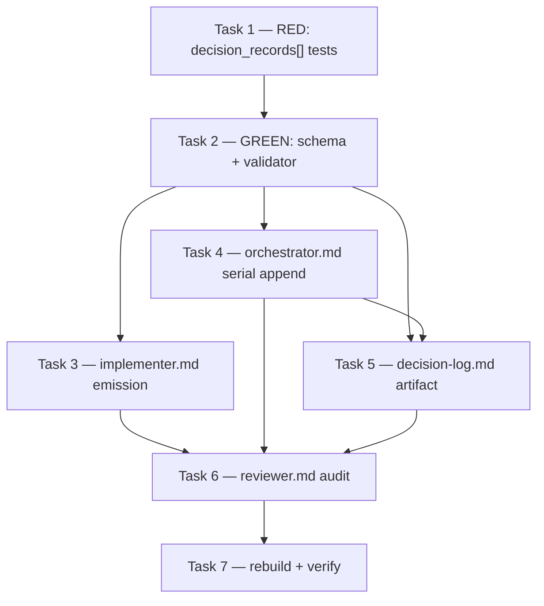

# Plan — M4: durable decision memory (`companion-substrate-closure` initiative)

> **Milestone M4** · Wave 1 · Depends on: — · Status: pending
>
>  Single-writer: the orchestrator appends decision-log.md serially post-barrier; workers never write it. Reviewer audit goes in a **new §15** (§10–§14 occupied).


## Objective

Bank Root-Cause Decision Records, Refactoring Verification Decision Records, Reuse Check
entries, and Improvement Records — today PR-body-only and lost the moment a clone is made —
into a durable, greppable, git-tracked file: `documentation/reference/decision-log.md`. The
implementer returns them as a new optional `decision_records[]` worker-JSON field; the
orchestrator, and only the orchestrator, appends them serially post-barrier, under the same
single-writer invariant that already governs `findings-ledger.json`
(`src/references/blackhole-state.md` § Single-writer invariant). This closes ADR-012 E4.

Scope is the **write path only**. The read path (injecting banked decisions back into worker
context) is explicit Future Work in ADR-012, gated behind three unmet prerequisites — this
plan does not touch it, and no task below implies it.

## Touch-Paths

`src/references/worker-schemas.md`, `scripts/validate-worker-json.ts`,
`scripts/validate-worker-json.test.ts`, `src/agents/implementer.md`,
`src/agents/orchestrator.md`, `src/agents/reviewer.md`,
`documentation/reference/decision-log.md`.

No file outside this list is touched. `.agents/build/*`, `codex-*`, `plugins/*` are generated
by `bun run build` and are edited only by Task 7's rebuild step, never by hand.

## Strategy

**TDD ordering.** The only real TypeScript in this milestone is the `decision_records[]`
validator. Per the workstation's binding TDD mandate, the test file changes as a standalone
task, committed to fail against the current validator, strictly before the validator/schema
task that makes them pass.

**Documentation-as-source tasks (T3, T4, T5, T6 below) are prompt-body edits to `src/agents/*.md`
files** — there is no compiled artifact to red/green against; their acceptance criteria are
content-presence and content-shape checks instead, verified by grep/read, not `bun test`.

**Task numbering renumbers the milestone's T1–T6** to make the TDD split explicit:

| This plan | Milestone (`milestone-4.md`) |
|---|---|
| Task 1 (test, RED) + Task 2 (impl, GREEN) | T1 |
| Task 3 | T2 |
| Task 4 | T3 |
| Task 5 | T4 |
| Task 6 | T5 |
| Task 7 | T6 |

## Issue DAG



Task 4 depends only on T2 (it needs the row shape to write the append pseudocode/spec, not the
artifact file). Task 5 additionally depends on T4 because the artifact's header text names the
writer and protocol T4 defines. Task 6 depends on T3 (the emission convention it audits), T4
(the append target it names), and T5 (the file it checks for a corresponding row).

## Task Breakdown

### Task 1 — RED: `decision_records[]` validation tests

**File**: `scripts/validate-worker-json.test.ts` (existing file — add one new `describe`
block; do not touch unrelated tests).

Add these cases, all initially **failing** against the current validator (no `decision_records`
handling exists yet):

1. `"accepts implementer JSON with decision_records[]"` — a `status: "complete"` implementer
   payload (all currently-required fields present: `pr_number`, `branch`, `tests_passed`,
   `touch_paths_honored`, `evidence`) plus:
   ```json
   "decision_records": [
     { "pr": 42, "kind": "root-cause", "touch_paths": ["src/db/client.ts"], "decision": "Use a prepared statement cache keyed by query shape", "why": "N+1 query was the actual regression, not the ORM" },
     { "issue": 12, "kind": "reuse", "touch_paths": ["scripts/lib/retry.ts"], "decision": "Reused existing retry() instead of a new backoff loop", "why": "Avoids a third retry implementation (V-INT-02)" }
   ]
   ```
   `expect(validateWorker('implementer', payload)).toEqual([])`.
2. `"accepts implementer JSON without decision_records[]"` — the same payload with the field
   omitted entirely. `expect(validateWorker('implementer', payload)).toEqual([])`. Proves the
   field is optional and existing callers are unaffected.
3. `"rejects malformed decision_records[] rows"` — one `test` per malformed shape (or
   `test.each`), each asserting `validateWorker('implementer', payload)` returns a non-empty
   array whose messages reference the offending field:
   - invalid `kind` (e.g. `"kind": "vibes"`) → error mentions `decision_records[0].kind`
   - both `pr` and `issue` absent → error mentions `decision_records[0]` and `pr`/`issue`
   - `touch_paths` not a string array (e.g. `"touch_paths": "src/x.ts"`) → error mentions
     `touch_paths`
   - `decision` or `why` missing → error mentions the missing field

**AC**: `bun test scripts/validate-worker-json.test.ts` shows exactly these new cases **failing**
(case 1 fails because the validator does not yet exempt/validate the field — actually passes
today since the field is simply ignored; the load-bearing RED cases are the malformed-row
rejections in bullet 3, which must fail today because nothing validates the field's shape).
Commit this task's diff separately before Task 2 begins.

**Rollback**: delete the new `describe` block; zero production-code impact.

---

### Task 2 — GREEN: `decision_records[]` schema + validator

*(depends on Task 1)*

**Files**: `src/references/worker-schemas.md` (Implementer section, after the `evidence`
subsection, ~line 380), `scripts/validate-worker-json.ts`.

**Row schema** (documented in `worker-schemas.md` as a new `### decision_records[]
(optional — ADR-012 E4)` subsection under `## Implementer (`implementer`)`, immediately after
the existing `### evidence` subsection):

| Field | Type | Required | Values / notes |
|---|---|---|---|
| `pr` | number | one of `pr` / `issue` required | PR number the decision was made in |
| `issue` | number | one of `pr` / `issue` required | issue number, when no PR exists yet |
| `kind` | string (enum) | yes | `root-cause` \| `approach` \| `refactor` \| `improvement` \| `reuse` |
| `touch_paths` | string[] | yes | files the decision governed |
| `decision` | string | yes | one line |
| `why` | string | yes | one line |

**Validator** (`scripts/validate-worker-json.ts`):

- Add `const DECISION_RECORD_KINDS = ['root-cause', 'approach', 'refactor', 'improvement', 'reuse'] as const;` alongside the other module-level enum arrays (near `TASK_TYPES`, line 22).
- Add `validateDecisionRecord(record: unknown, path: string): string[]` mirroring the existing
  `validateFinding` pattern (line 104): `isObject` guard, `requireField` for `kind`
  (`isString` + `pushEnumError` against `DECISION_RECORD_KINDS`), `touch_paths`
  (`isStringArray`), `decision` and `why` (`isNonEmptyString`); then a manual check that at
  least one of `pr` (`isNumber`) / `issue` (`isNumber`) is present, pushing
  `` `${path}: exactly one of pr or issue is required` `` when neither validates.
- Add `validateDecisionRecordsArray(value: unknown, path: string): string[]` mirroring
  `validateFindingsArray` (line 129).
- In `validateImplementer` (line 249), after the existing `filed_issues` check (line 303),
  add: `if ('decision_records' in data && data.decision_records !== undefined) { errors.push(...validateDecisionRecordsArray(data.decision_records, 'decision_records')); }` — optional field,
  absence is not an error, matching the `new_findings`/`filed_issues` precedent immediately
  above it.

**AC**: all Task 1 cases pass — `bun test scripts/validate-worker-json.test.ts` green, 0 fail.
`worker-schemas.md` Implementer table (line 306-318) gains a `decision_records` row pointing to
the new subsection, so the field is documented at both the summary-table and detail-subsection
levels (matches the existing convention for `execution_mode`/`task_type`/`escalation_trigger`).

**Rollback**: revert both files; the field reverts to being silently ignored by the validator,
which is exactly today's behavior (no consumer reads it yet, so no data loss).

---

### Task 3 — implementer emission

*(depends on Task 2)*

**File**: `src/agents/implementer.md`.

At every gate that already produces a Root-Cause Decision Record, Refactoring Verification
Decision Record, Reuse Check entry, or Improvement Record for the PR body (Bugfix Gate,
Reuse Check Gate, Scout Check — see `worker-schemas.md` lines 362-366 for the existing
cross-references into `implementer.md`), add: emit the **same** decision as one row in the
worker JSON's `decision_records[]`, **in addition to** the existing PR-body text — never
instead of it. `kind` maps 1:1 from the gate that produced the record (Bugfix Gate root-cause
→ `root-cause`; Refactoring Verification → `refactor`; Reuse Check → `reuse`; Scout Check
Improvement Record → `improvement`; a plan-approach decision documented elsewhere → `approach`).

**AC**: for each of the four record-producing gates in `implementer.md`, the gate's
instructions explicitly state "also append a `decision_records[]` row" with the row's `kind`
named. Verified by grep: `grep -c 'decision_records' src/agents/implementer.md` returns ≥4
(one mention per gate, plus the shared field-shape note).

**Rollback**: `decision_records[]` stays optional (Task 2); reverting this task alone means
implementer sessions stop emitting rows but the schema and orchestrator machinery remain
harmlessly present — matches the milestone's own stated rollback plan verbatim.

---

### Task 4 — orchestrator serial append (single-writer)

*(depends on Task 2)*

**File**: `src/agents/orchestrator.md`.

**Design constraint (V-CONTENTGATE-01, `scripts/checks/core.check.ts:764-780`)**: the
`## Background worker barrier (Cursor / Pattern B)` section — which contains `### Triage
(idempotent)`, the existing single-writer append logic for `findings-ledger.json` — is
**baseline-grandfathered at 46 LOC**. It may shrink, it must never grow by even one line. This
means the milestone's phrasing "new budgeted section + pointer" **cannot** mean inserting a
pointer line into Triage's existing text — that would be growth of a frozen section. The
one-line pointer instead lives **inside the new section**, pointing *back* at Triage by
reference only:

Add a brand-new section, `## Decision Record Append (decision-log.md)`, placed immediately
after `## Background worker barrier (Cursor / Pattern B)` (before `## Checkpoint protocol`),
budgeted at **≤50 LOC** per `CONTENT_GATE_NEW_SECTION_BUDGET_LOC`
(`core.check.ts:786`). Content:

- One line naming when it fires: "Invoked as part of § Background worker barrier → Triage step
  2's per-role ledger mutations, for the `implementer` role only — never a separate barrier
  phase." (this is the one-line pointer; it lives here, not in Triage)
- The append protocol itself: for each completed `implementer` worker carrying a non-empty
  `decision_records[]`, the orchestrator — and only the orchestrator, serially, one worker at a
  time, after the parallel batch has fully barriered — appends one row per array entry to
  `documentation/reference/decision-log.md`, using the same read-modify-write-via-`.tmp`+`mv`
  atomic-write protocol as `queue.json`/`findings-ledger.json`
  (`src/references/blackhole-state.md` § Write protocol).
- Row-to-table-column mapping: copy `pr`/`issue`, `kind`, `touch_paths` (joined), `decision`,
  `why` verbatim into the log's table row; no field transformation.
- Rotation trigger check (row count > 500 → oldest rows move to `_archive/`) delegated by
  one-line pointer to Task 5's file, not re-specified here (`V-DRY`).

**AC**: `## Decision Record Append (decision-log.md)` exists as a new `##` section in
`src/agents/orchestrator.md`, line count ≤50 (`scripts/checks/core.check.ts`'s
`findContentGateViolations` against `CONTENT_GATE_NEW_SECTION_BUDGET_LOC` — run via `bun run
verify` in Task 7, or standalone: `bun run scripts/checks/core.check.ts` and confirm no
`V-CONTENTGATE-01` failure). `## Background worker barrier (Cursor / Pattern B)`'s line count is
unchanged at 46 (diff shows zero net lines added/removed inside that section's span).

**Rollback**: delete the new section; `decision_records[]` rows are simply never appended
(implementer still emits them harmlessly per Task 3's independent rollback).

---

### Task 5 — the decision-log.md artifact

*(depends on Task 4)*

**File**: `documentation/reference/decision-log.md` (new file; `documentation/reference/`
does not yet exist in this repo — confirmed via glob, no pre-existing files to collide with or
search-before-write against).

```markdown
---
type: reference
status: current
review_trigger: "on file change"
created: 2026-07-20
last_updated: 2026-07-20
related:
  - documentation/decisions/ADR-012-shared-artifact-substrate.md
---

# Decision Log

Durable, greppable record of implementation decisions — Root-Cause Decision Records,
Refactoring Verification Decision Records, Reuse Check entries, and Improvement Records —
banked by the orchestrator from `decision_records[]` (ADR-012 E4). **Append-only. Written
solely by the orchestrator**, serially, post-barrier — see `src/agents/orchestrator.md` §
Decision Record Append. No worker writes this file directly.

## Rotation

When this table exceeds 500 rows, the orchestrator moves the oldest rows to
`documentation/reference/_archive/decision-log-{first-issue}-{last-issue}.md`, mirroring the
`findings-ledger.json` archive convention (`src/references/blackhole-state.md`). This file
itself is never deleted, only trimmed.

## Records

| PR/Issue | Kind | Touch Paths | Decision | Why |
|---|---|---|---|---|
```

Frontmatter satisfies `doc-governance.md`'s required `type`/`status` fields pre-emptively, per
the milestone's own stated risk mitigation ("T4 ships lifecycle frontmatter with the file").

**AC**: file exists at the path above; frontmatter has `type: reference` and `status: current`;
a `## Rotation` section states the 500-row threshold and `_archive/` destination in prose
matching Task 4's design. `bun run scripts/checks/*.check.ts` (whichever check owns
V-DOC-GOV-02 frontmatter presence) reports no finding against this file.

**Rollback**: delete the file; Task 4's append logic degenerates to a no-op write-target-missing
error, which is a fail-loud state, not silent data loss — acceptable because this task lands
before Task 4 is ever exercised end-to-end (Task 7 gates that).

---

### Task 6 — reviewer audit

*(depends on Task 3, Task 4, Task 5)*

**File**: `src/agents/reviewer.md`.

**Clarification against the milestone spec**: `milestone-4.md` T5 names "`reviewer.md` §10" as
the target, but the current file's `§10` is already occupied by `### 10. Companion-File Audit
(V-ADA-01/02/03/05/06/07)`, with `### 11. Confidence-Based Finding Filtering & Consolidation`
following it. The milestone's section number predates the file's current numbering. This task
adds a **new** `### 15. Decision Record Audit (ADR-012 E4)` subsection after the existing §14
(`Information-Hierarchy Audit`, the current highest — §10 is Companion-File Audit, §12 is
Suggestion Proportionality Gate, §13 is Recheck-Mode Compliance; all are occupied),
rather than overwriting §10 — renumbering existing sections is out of this plan's Touch-Paths
and would be unrelated scope creep.

Content: WARN (new V-code `V-INT-04`-class finding, or reuse `V-DOC-GOV`-style WARN severity
per this repo's existing WARN precedent — cite as `V-DECISION-01` in the finding, a repo-local
code not yet in `blackhole-vcodes.md`) when the PR body contains a Root-Cause/Refactoring
Verification/Reuse Check/Improvement Record (detected via the same heading text
`implementer.md`'s gates already emit into PR bodies) but the worker JSON's
`decision_records[]` carries no row for it.

**AC**: a fixture PR body containing a Decision Record heading with no corresponding
`decision_records[]` entry produces a WARN-severity finding when reviewer logic is exercised
(spot-checked by reading the new subsection's detection/check bullets — this is a prompt-body
task, not compiled code, so AC is content-shape verification: the subsection names a concrete
detection signal and a concrete severity, not vague language like "flag if missing").

**Rollback**: delete the new `### 15.` subsection; reviewer behavior reverts to not auditing
`decision_records[]` presence — Tasks 3-5 remain independently functional (the log still gets
written when implementers emit rows; only the missing-row WARN disappears).

**V-code note**: this WARN is repo-local scope; add it to `blackhole-vcodes.md` in a follow-up
issue if the campaign wants it tracked in the ledger's canonical table — out of this plan's
Touch-Paths (`.claude/rules/blackhole-vcodes.md` is not in the Touch-Paths list above).

---

### Task 7 — rebuild + verify

*(depends on Task 3, Task 4, Task 5, Task 6)*

Run `bun run build` (regenerates `.agents/build/agents/*`, `codex-*`, `plugins/*` from the
`src/` edits above — never hand-edit these), then `bun run verify` (28 checks, including
`V-CONTENTGATE-01`) and the full `bun test` suite.

**AC**: `bun run verify` exits 0 with all 28 checks passing (explicit pass on
`V-CONTENTGATE-01` — the Task 4 gate this whole design was constrained by). `bun test` exits 0,
full pass count reported, zero fail — including Task 1/2's new `decision_records[]` cases.

**Rollback**: N/A — this task only runs build/verify tooling; it does not hand-edit source. A
failure here means one of Tasks 1-6 needs its own rollback, not this task's.

## R8 Proof — no write-contention under `parallel_max > 1`

ADR-012 Risk R8 ("`decision-log.md` write contention under `parallel_max > 1`") is mitigated
by construction, not by locking:

1. **No worker ever calls `Write`/`Edit` on `decision-log.md`.** Grep-verifiable at Task 7:
   `grep -rn 'decision-log.md' src/agents/implementer.md` must show **zero** matches to a
   write/append instruction — the implementer's only obligation (Task 3) is populating
   `decision_records[]` in its own return JSON, a value it already owns exclusively (its own
   worker-JSON return is never shared across workers).
2. **The orchestrator is the only actor with `Write` access to the file** (Task 4's new
   section), and it applies mutations **serially, one completed worker at a time**, identical
   to the existing `findings-ledger.json` protocol
   (`src/references/blackhole-state.md` § Single-writer invariant, `orchestrator.md` § Triage
   step 2). Concurrent workers in one wave return their JSON independently and in parallel —
   but the *application* of that JSON to the shared file happens only after the barrier, in a
   loop with no re-entrancy: worker N's row is appended, the in-memory/on-disk file state
   advances, then worker N+1's row is appended against the now-updated state. No two workers'
   writes ever race, because no worker writes — only reads (none) and returns (JSON, in-memory,
   no file handle).
3. This is the same argument `blackhole-state.md` already makes for `findings-ledger.json`,
   extended verbatim to a second file under the identical writer. No new locking or CAS
   machinery is introduced (matches `blackhole-state.md`'s own stated rejection of `flock`/CAS
   for the existing invariant — the single-orchestrator-per-campaign topology already closes
   the race).

## Codebase Conventions

| Touchpoint | Convention | Source |
|---|---|---|
| Worker JSON validation | `isObject`/`requireField`/`pushEnumError`/`isStringArray`/`isNonEmptyString` helper predicates; enum arrays as `const X = [...] as const` near top of file; array validators follow the `validateFinding`/`validateFindingsArray` two-function pattern | `scripts/validate-worker-json.ts` lines 46-139 |
| Optional worker-JSON fields | Guarded with `if ('field' in data && data.field !== undefined)`, never bare truthy checks (distinguishes "absent" from "present but falsy") | `scripts/validate-worker-json.ts` lines 272-305 (`execution_mode`, `task_type`, `filed_issues`) |
| worker-schemas.md documentation | Every optional field gets a `### field_name (optional — <ADR/issue ref>)` subsection with a `**Non-goal**`/consumer-status note when relevant, cross-referenced from the summary table above it | `src/references/worker-schemas.md` lines 320-380 |
| Shared-file writes | Single-writer invariant: only the orchestrator writes `queue.json`/`findings-ledger.json`(/now `decision-log.md`); workers return JSON, orchestrator applies serially post-barrier via atomic `.tmp`+`mv` | `src/references/blackhole-state.md` § Single-writer invariant; `src/agents/orchestrator.md` § Triage |
| `orchestrator.md` section growth | `## <name>` sections present at a frozen commit are GROW-NEVER (may shrink only); new sections are capped at 50 LOC | `scripts/checks/core.check.ts:764-786` (V-CONTENTGATE-01) |
| `documentation/` lifecycle frontmatter | `type`/`status`/`review_trigger`/`created`/`last_updated` required; `reference/` is the taxonomy home for durable non-ADR reference material | `.claude/rules/doc-governance.md`; `documentation/decisions/ADR-012-...md` §E4 |

## Execution Assignments

| Task | Agent | Model | Notes |
|---|---|---|---|
| Task 1 — RED tests | `mercure:x-tester` | sonnet (full mode) | Owns test authorship/execution; writes failing cases first, confirms RED |
| Task 2 — GREEN schema + validator | `general-purpose` | sonnet | Implements `decision_records[]` validator + `worker-schemas.md` subsection to turn Task 1 green |
| Task 3 — implementer.md emission | `general-purpose` | sonnet | Prompt-body edit across 4 named gates |
| Task 4 — orchestrator.md serial append | `general-purpose` | sonnet | Must respect V-CONTENTGATE-01 budget; verify LOC count before finishing |
| Task 5 — decision-log.md artifact | `mercure:x-doc-writer` | sonnet (full mode) | New reference doc with lifecycle frontmatter |
| Task 6 — reviewer.md audit | `general-purpose` | sonnet | New §15 subsection; explicit renumbering clarification documented in-task |
| Task 7 — rebuild + verify | `mercure:x-tester` | sonnet (full mode) | Runs `bun run build`, `bun run verify`, full `bun test`; reports evidence per Verification Evidence Gate |

## Risks

| ID | Risk | Impact | Mitigation |
|---|---|---|---|
| R1 (this plan) | `## Background worker barrier` is grandfathered at exactly 46 LOC; an accidental single-line edit inside it (even whitespace) fails `V-CONTENTGATE-01` | Medium | Task 4 places all new content in a brand-new section; Task 7's `bun run verify` catches any accidental drift before merge |
| R2 (this plan) | Reviewer §-numbering mismatch (milestone says §10, file has §10 = Companion-File Audit) causes confusion for a future reader diffing against the milestone doc | Low | Task 6 documents the discrepancy explicitly in its own task body; no renumbering performed (scope discipline) |
| R3 = ADR-012 R4 | `decision-log.md` grows unbounded | Low | Task 5 documents the 500-row rotation threshold; enforcement (an actual rotation script/check) is not in this plan's Touch-Paths — noted as a gap, not silently assumed solved |
| R4 = ADR-012 R8 | Write contention under `parallel_max > 1` | High → mitigated | See § R8 Proof above; single-writer invariant extended verbatim from `findings-ledger.json` |
| R5 (this plan) | Task 3's grep-based AC (`decision_records` mention count ≥4) is a weak proxy for "every gate actually emits a correctly-shaped row" | Medium | Task 6's reviewer audit is the compensating control — a missing row is caught at PR-review time even if `implementer.md`'s prose under-specifies a gate |
| R6 (this plan) | Task 5's rotation threshold is documented but not mechanically enforced (no script checks row count in this plan) | Low | Explicitly flagged as future work in Task 5's AC; matches ADR-012's own Future Work framing for anything beyond the write path |
