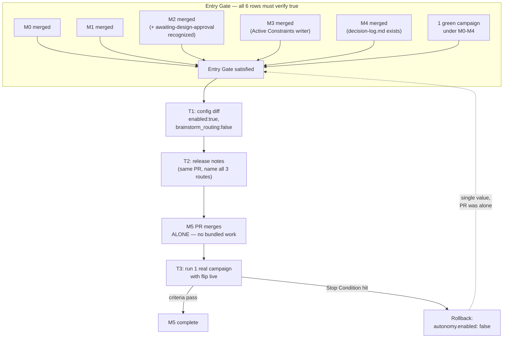

# Plan — M5 (E5): Autonomy Default Flip

> **Milestone M5** · Wave 4 · Depends on: M0, M1, M2, M3, M4 · Status: blocked
>
>  Only BREAKING milestone (3 dispatch sites). Lands alone, last, after one green campaign. Rollback: `autonomy.enabled: false`.


> **This is the only BREAKING milestone in `companion-substrate-closure`.** It lands **alone,
> last**, in its own PR, after M0–M4 are merged and one campaign has run green under them. The
> plan's job here is as much about the entry gate and rollback discipline as about the diff
> itself — the diff is three JSON values.

## Objective

Flip `.blackhole/config.json` `autonomy.enabled` from `false` to `true`, while **explicitly
pinning** `autonomy.brainstorm_routing` to `false` (it currently defaults `true` alongside
`design_autonomy` and `analyze_routing`). Because `enabled` is a master switch layered over
sub-flags that already default `true` (ADR-012 Finding 6), a naive one-line flip would silently
activate **three** behavioural routes at once — including brainstorm routing, which has
**terminal semantics** (ADR-010 D3: a brainstorm-routed issue never produces a mergeable PR, it
closes as satisfied-by-children). This plan flips the master switch and pins all four autonomy
sub-flags to their intended M5 values in one diff, ships a release note naming all three affected
routes, and defines an observable "green campaign" verification gate before the milestone is
considered complete.

## Entry Gate (all must be true before T1 starts)

| # | Condition | Verification method | Evidence artifact |
|---|---|---|---|
| 1 | M0 merged — reuse aperture + Scout/defer split live | `git log main --grep='M0'` shows a merged PR; confirm the corresponding `documentation/milestones/_active/companion-substrate-closure/milestone-0.md` task checkboxes are all `[x]` | Merge commit SHA on `main` |
| 2 | M1 merged — schema precedence live | Same pattern: merged PR + `milestone-1.md` checkboxes `[x]` | Merge commit SHA on `main` |
| 3 | M2 merged — promotion path live, design-track blocks actually resume | Merged PR + `milestone-2.md` checkboxes `[x]`; additionally, grep `coordinator.md` for `awaiting-design-approval` in its recognized blocked-notes set (ADR-012 Finding 3b repair) — must be present, not just planned | `grep -n "awaiting-design-approval" src/agents/coordinator.md` returns a match |
| 4 | M3 merged — Active Constraints has a writer | Merged PR + `milestone-3.md` checkboxes `[x]`; grep confirms a writer exists (no longer zero, per ADR-012 Finding 4) | `grep -rn "Active Constraints" src/agents/planner.md` returns a write-path match, not just a reader |
| 5 | M4 merged — decision memory durable | Merged PR + `milestone-4.md` checkboxes `[x]`; `documentation/reference/decision-log.md` exists with lifecycle frontmatter | `test -f documentation/reference/decision-log.md` |
| 6 | One campaign run green **with 1–5 in place** | A completed campaign run (post-M4 merge) reaches `campaign-complete` with zero unresolved BLOCK-severity ledger rows; `findings-ledger.json` for that run shows no `open` CRITICAL/HIGH entries | Campaign run log / `.blackhole/queue.json` snapshot showing all in-scope issues at `merged` or `closed` |

**Do not start T1 until all six rows are independently verifiable, not merely "planned."** Row 6
specifically catches the ADR-012 ⚡ oversimplification risk — "quality gates landed" is not
binary; a green campaign is the only evidence that M0's grep-cost tuning and M1–M4's write paths
actually hold up under real dispatch, not just unit-level review.

## Config Diff (exact, flag by flag)

File: `src/references/config-template.md` line 25 (the committed `.blackhole/config.json`
template's `autonomy` block).

```diff
-  "autonomy": { "enabled": false, "confidence_threshold": 80, "design_dominance_delta": 30, "design_autonomy": true, "analyze_routing": true, "brainstorm_routing": true, "never_bypass": ["destructive", "credentials", "epic-go-no-go"] },
+  "autonomy": { "enabled": true, "confidence_threshold": 80, "design_dominance_delta": 30, "design_autonomy": true, "analyze_routing": true, "brainstorm_routing": false, "never_bypass": ["destructive", "credentials", "epic-go-no-go"] },
```

| Flag | Old | New | Rationale |
|---|---|---|---|
| `enabled` | `false` | **`true`** | Master switch — blackhole should decide what it can decide once M0–M4 and a green campaign have proven the write paths and quality gates it now dispatches into |
| `confidence_threshold` | `80` | `80` (unchanged) | Not in scope for this milestone; ADR-010 D6's composite threshold is tuned separately from the enable/disable decision |
| `design_dominance_delta` | `30` | `30` (unchanged) | Same — ADR-010 D4's dominance bar is a separate tuning lever |
| `design_autonomy` | `true` | `true` (unchanged, now live) | Safe to activate: gated by blind critics (2 independent scorers, blind to the primary's provisional Chosen) plus the deterministic `scripts/design-aggregate.ts` verdict (ADR-010 D4) — the planner cannot self-certify this path, only the script's own computed `status: "ready"` reaches it |
| `analyze_routing` | `true` | `true` (unchanged, now live) | Safe to activate: `analyze` produces a read-only evidence note (`plans/issue-N-analysis.md`) with no terminal or merge semantics — worst case is a wasted investigator spawn, not an unreviewable state change |
| `brainstorm_routing` | `true` | **`false`** (changed) | **Not** safe to activate silently: terminal-closure semantics (ADR-010 D3) mean a brainstorm-routed issue closes as satisfied-by-children and never produces a reviewable PR. Closing an issue as "satisfied by its children" is a product judgement call — it stays opt-in until a future milestone deliberately re-enables it with its own entry gate |
| `never_bypass` | `["destructive","credentials","epic-go-no-go"]` | unchanged | These are the surviving guarantee — see § Guarantees below |

**Why `design_autonomy` and `analyze_routing` stay `true` while `brainstorm_routing` flips to
`false`, even though all three "already defaulted true" per ADR-012 Finding 6**: the
discriminator is not "was it already true" but "does activating it produce an irreversible or
unreviewable state change." Design and analyze routes both terminate in a **reviewable artifact
inside a PR** (ADR-010 D5 — merge is the approval gate). Brainstorm route terminates in an
**issue closure with no PR at all**. Same flip mechanism, different consequence class — hence
selective pinning rather than uniform enable-all-or-nothing.

## Blast-Radius — 3 dispatch sites (ADR-012 undercounted this as "1 BREAKING"; it is 3)

ADR-012's own Refactoring Impact table lists it correctly as 3 BREAKING rows — this plan makes
the site-level detail explicit so the entry-gate green campaign (Entry Gate row 6) and T3
verification can be checked against concrete file:line, not the aggregate ADR summary.

| # | Site | File:Line | What observably changes when `enabled` flips true |
|---|---|---|---|
| 1 | **Design gate** | `src/agents/planner.md:106` (gate condition, §4.8 preamble) and `src/agents/planner.md:169` (gate invocation) | Today: Design Track §4.8 returns `status: blocked` unconditionally — every design issue always waits for a human. After flip: when `scripts/design-aggregate.ts` independently computes `status: "ready"` from the primary's weighted matrix + both blind critics' JSON + zero BREAKING Refactoring-Impact rows, the design promotes straight to `documentation/decisions/ADR-{NNN}-{slug}.md` inside the issue's own PR — **no human pause**. Campaigns will stop pausing at design gates they previously always paused at. |
| 2 | **Analyze dispatch** | `src/references/phase-handle.md:70` (spawn-condition gate) and `src/references/queue-dag.md:82` (`needs_analysis` field's gating note) | Today: `needs_analysis` is computed by the router but dispatch to the investigator's `analyze` sub-mode never fires (gated off). After flip: for `size:l`+ issues or any `needs_design: true` issue, the investigator is now actually spawned in `analyze` sub-mode, producing `documentation/audits/analysis-issue-N.md` and triggering the router's `analysis-landed` re-route checkpoint. Campaigns will begin dispatching `needs_analysis` routes that were previously inert. |
| 3 | **Brainstorm dispatch** | `src/agents/orchestrator.md:157` (Brainstorm dispatch precedence block) | Today: inert — `autonomy.enabled` is false so this branch never evaluates true regardless of `route.confidence.brainstorm`. After flip: **stays inert**, deliberately — because `brainstorm_routing` is pinned `false` in the same diff, the `autonomy.enabled && autonomy.brainstorm_routing` conjunction at `orchestrator.md:157` never resolves true. This is the one site where the flip changes the *evaluated condition* (enabled is now true) but not the *observed behaviour* (still false, because of the AND). |

Site 3 is the one most likely to be miscounted as "unaffected" — it **is** affected (the
condition's left operand flips), it just doesn't change observable behaviour because of the
explicit pin. T3's verification must confirm this empirically (see § T3 Verification Criteria),
not just trust the config value.

## Guarantees That Survive The Flip

`autonomy.never_bypass: ["destructive", "credentials", "epic-go-no-go"]` is **unchanged** by this
diff. Per ADR-010 D6, these categorical triggers always force human escalation **regardless of
composite confidence score** — they are checked before any confidence math runs, at the
`confidence-gates.md` kernel consumed by router, planner, and orchestrator gates alike. Concretely,
after the flip:

- A destructive/irreversible operation still blocks and escalates, even if `design_autonomy` or
  `analyze_routing` would otherwise let the surrounding issue proceed autonomously.
- Anything touching credentials, KYC, or account actions still blocks.
- Epic go/no-go decisions still require a human — autonomy never extends to the campaign's
  scope boundary itself.

This list is not modified by M5 and is the primary reason the rollback (single config value) is
sufficient rather than needing a broader safety audit: the irreversible-action floor was never
raised by this milestone, only the design/analyze routing ceiling.

## Touch-Paths

`src/references/config-template.md` (the diff above), plus release-note content (T2) — no other
source file changes. This is deliberately the narrowest possible touch-path set for a BREAKING
milestone: the behavioural change is entirely a consequence of three existing, already-built
conditionals (the 3 blast-radius sites) evaluating differently, not new code.

## Strategy

1. Verify the Entry Gate (all 6 rows) before any edit — this is a hard blocking precondition,
   not advisory.
2. T1: single-commit config diff exactly as specified above, in its own branch/PR — no other
   file changes bundled in.
3. T2: release notes drafted in the same PR, naming all three routes explicitly (including the
   pinned-off one) — reviewers must see the full blast radius before approving the merge, not
   discover it after.
4. Merge M5's PR alone — no other milestone work rides in the same PR (this is the load-bearing
   reason the rollback stays single-value; see § Rollback).
5. T3: run one real campaign with the flip live; observe against the criteria in § T3
   Verification Criteria before declaring M5 complete.
6. If T3 finds a regression matching a Stop Condition, execute rollback immediately — do not
   attempt a partial fix in place while autonomy is live on a real campaign.

## Issue DAG



## Task Breakdown

- [ ] **T1 — Flip the master switch and pin the sub-flags explicitly**
  - Edit `src/references/config-template.md` line 25 per the exact diff in § Config Diff.
  - **AC** (all machine-verifiable against the merged diff):
    1. `grep -o '"enabled": true' src/references/config-template.md` (within the `autonomy`
       block) matches.
    2. `grep -o '"brainstorm_routing": false' src/references/config-template.md` matches.
    3. `grep -o '"design_autonomy": true' src/references/config-template.md` and
       `grep -o '"analyze_routing": true' src/references/config-template.md` both still match
       (unchanged, not accidentally flipped in the same edit).
    4. `grep -o '"never_bypass": \["destructive", "credentials", "epic-go-no-go"\]'
       src/references/config-template.md` matches exactly (byte-for-byte unchanged array).
    5. No other line in `config-template.md` changes in this commit (diff is exactly the one
       line shown in § Config Diff).

- [ ] **T2 — Release-note the behavioural change**
  - Draft release notes for the version that ships this flip.
  - **AC**:
    1. Release notes explicitly name all three routes: design autonomy, analyze routing, and
       brainstorm routing.
    2. The brainstorm routing entry explicitly states it is pinned **off** and explains why
       (terminal-closure semantics, ADR-010 D3) — not silently omitted because "nothing
       changed."
    3. Release notes state the observable behaviour change for campaign operators: "campaigns
       will stop pausing at design gates they previously always paused at, and will begin
       dispatching `needs_analysis` routes for size:l+ and design-flagged issues."
    4. Rollback instructions (single config value) are included in the release notes, not just
       in this plan.

- [ ] **T3 — Verify on a real campaign**
  - Run one live campaign with the M5 diff active.
  - **AC**: see § T3 Verification Criteria below — all four observable criteria must hold for
    the run to count as "green" for this milestone.

## T3 Verification Criteria — what "green" observably means here

A green M5 campaign run is **not** merely "no crashes." Given this is the only BREAKING
milestone, define green as all four holding simultaneously:

1. **Escalations observed are substantive, not noise.** For every issue that still reaches
   `status: blocked` with a human escalation during the run, the escalation reason must trace to
   a `never_bypass` category (destructive/credentials/epic-go-no-go) or a genuine sub-threshold
   confidence score — not a config-wiring artifact. Concretely: grep the run's escalation log;
   zero escalations should read as "autonomy flag present but route still blocked for no stated
   reason."
2. **No unintended brainstorm dispatch fired.** Grep `queue.json` (or the run's ledger) for any
   issue that transitioned via `track: brainstorm` during this run. Expected count: **zero**.
   This is the direct empirical check on Blast-Radius site 3 — config alone says it should stay
   inert; T3 confirms the campaign never actually reached that branch.
3. **Design gates resolved autonomously where confidence permitted, and blocked correctly where
   it didn't.** At least one design-track issue in the run either (a) promoted to an ADR
   autonomously via `scripts/design-aggregate.ts`'s `status: "ready"` verdict with the ADR
   visibly committed inside its PR, or (b) correctly returned `status: "blocked"` because
   dominance/discriminating-CRITICAL/BREAKING conditions weren't met. A run with zero
   design-track issues does not exercise this criterion — re-run on a campaign that includes at
   least one, or explicitly note the gap and defer full T3 confidence to the next campaign.
4. **Analyze dispatch fired for at least one qualifying issue** (`size:l`+ or
   `needs_design: true`) and produced a well-formed `documentation/audits/analysis-issue-N.md`
   note that triggered the router's `analysis-landed` checkpoint. Confirms Blast-Radius site 2
   is live end-to-end, not just config-true.

If criterion 1 or 2 fails, treat it as a Stop Condition (see below) — halt the campaign and
roll back before continuing. If criterion 3 or 4 cannot be exercised (no qualifying issues in
this particular run), document the gap and require the next campaign to close it before treating
M5 as fully proven — the milestone stays technically merged but its verification is incomplete
until both are observed at least once.

## Release-Note Content (T2 deliverable, restated for reviewer visibility)

The release notes for the version shipping M5 MUST name all three routes:

> **Autonomy default flip.** `.blackhole/config.json` `autonomy.enabled` now defaults to `true`.
> Two routes activate: **design autonomy** (design-track issues may now promote directly to an
> ADR inside their PR when blind-critic scoring and a deterministic script agree, instead of
> always pausing for a human) and **analyze routing** (large or design-flagged issues now
> automatically get an evidence-gathering pass before planning). **Brainstorm routing stays
> pinned off** (`autonomy.brainstorm_routing: false`) — brainstorm-routed issues close as
> satisfied-by-children with no reviewable PR, and that product judgement remains opt-in.
> Rollback: set `autonomy.enabled: false` in `.blackhole/config.json` to restore prior behaviour
> exactly.

## Rollback

Single config value: `autonomy.enabled: false` in `.blackhole/config.json` restores current
(pre-M5) behaviour exactly — all three dispatch sites (planner.md:106/169,
phase-handle.md:70/queue-dag.md:82, orchestrator.md:157) fall back to their existing
`enabled`-gated `false` branches, which are unmodified by this milestone.

**Why landing alone matters**: this milestone's PR contains exactly one file's diff (the config
line) plus release notes — no other work rides in it. If M5 shipped bundled with unrelated work
from a later milestone, a rollback triggered by a T3 Stop Condition would have to either (a)
revert the bundle and lose the unrelated work, or (b) hand-craft a partial revert that
re-introduces the exact "was this edit intentional" ambiguity this plan exists to eliminate.
Landing alone means the single config value **is** the entire rollback — no git archaeology
required to figure out what else needs unwinding.

## Stop Conditions

Risk Assessment below contains a HIGH-impact item (autonomy flipped before quality is
sufficiently proven, and R5's three-simultaneous-route activation). Per the plan's risk profile,
these executor-halt rules apply during T3:

1. **Any brainstorm-track dispatch observed during the T3 campaign** (Blast-Radius site 3
   supposedly inert) — halt the campaign immediately, do not let it continue running with a live
   PR-less issue closure in flight, and roll back before investigating root cause.
2. **Any `never_bypass` category (destructive, credentials, epic-go-no-go) proceeds without a
   human escalation** — treat as a CRITICAL regression, halt the campaign, roll back
   immediately. Do not attempt a live patch while autonomy is active on a real campaign.
3. **Entry Gate row 6 (green campaign under M0–M4) cannot be independently verified** (no
   discoverable run log / queue snapshot proving all six conditions) — do not start T1. A plan
   whose entry gate can't be checked is not ready to execute, regardless of how confident the
   milestone author is that the prerequisites are met.

## Execution Assignments

| Task | Agent | Model | Notes |
|---|---|---|---|
| Entry Gate verification | `blackhole:orchestrator` | sonnet | Read-only checks against merge history, `coordinator.md`, `planner.md`, and `documentation/reference/decision-log.md`; escalates to human if any of the 6 rows can't be independently confirmed (Stop Condition 3) |
| T1 — config diff | `blackhole:implementer` | sonnet | Single-file edit in its own worktree/branch; baseline test run per standard implementer contract; PR carries only this diff |
| T2 — release notes | `blackhole:implementer` | sonnet | Same PR as T1 (bundled per § Strategy step 3); drafts the content in § Release-Note Content verbatim, adapted to the actual version number |
| PR review | `blackhole:reviewer` | sonnet | Audits the diff against § Config Diff exactly (byte-for-byte — this is a config value change where an off-by-one flag is the entire risk surface); confirms release notes name all three routes per T2 AC |
| T3 — campaign verification | `blackhole:orchestrator` | sonnet | Runs the live campaign per standard Multitask Mode; a **human** reviews the T3 Verification Criteria checklist before M5 is marked complete — this is the terminal gate for the only BREAKING milestone and is not auto-approved by the orchestrator alone |

## Codebase Conventions

| Touchpoint | Convention | Source |
|---|---|---|
| `config-template.md` `autonomy` block edits | Single-line JSON object per config block (not multi-line pretty-printed) — matches the existing style of every other top-level config block (`docs_governance`, `kaizen`, `incident_mode`) in the same file | `src/references/config-template.md:6-29` (committed template) |
| `config-template.md` field-documentation table | Every field change is paired with a row update in the `| Field | Required | Description |` table below the JSON block — this milestone's diff touches only JSON values already fully documented in existing rows (`autonomy.enabled`, `autonomy.brainstorm_routing`), so no new table rows are needed, but existing rows' "when true/false" language must still read correctly against the new defaults | `src/references/config-template.md:65-72` |
| Kill-switch / opt-in config pattern | `autonomy` follows the same absent-block-or-`false`-preserves-behaviour contract as `kaizen` and `incident_mode` — this milestone does not introduce a new pattern, it flips an existing opt-in's default | ADR-010 D8; `config-template.md:65` contract note |
| ADR/milestone frontmatter | `type`, `status`, `created`, `last_updated`, `review_trigger`, `related` — this plan's frontmatter matches the schema already used by `milestone-5.md` and `ADR-012-shared-artifact-substrate.md` | `documentation/milestones/_active/companion-substrate-closure/milestone-5.md:1-10`; `.claude/rules/doc-governance.md` |

## Risks

| ID | Risk | Impact | Mitigation |
|---|---|---|---|
| R1 (ADR-012 R5) | Flipping enables three routes at once, including brainstorm terminal-closure | High | `brainstorm_routing` pinned `false` in the same diff (§ Config Diff); Blast-Radius site 3 empirically re-verified in T3 criterion 2, not just trusted from config |
| R2 | Autonomy flipped before quality is actually proven | High | Entry Gate (6 rows, all independently verifiable) is a hard blocking precondition — not advisory; Stop Condition 3 halts T1 if row 6 can't be confirmed |
| R3 (ADR-012 ⚡) | "Quality gates landed" treated as binary when M0's grep cost or other tuning may still need work | Medium | The green-campaign entry-gate requirement (row 6) exists specifically to surface this before the flip, not after |
| R4 | T3's "green" criteria are under-specified, allowing a superficially clean run to count despite gaps | Medium | § T3 Verification Criteria defines 4 concrete, machine-checkable-where-possible conditions; criteria 3/4 explicitly call out when a run doesn't exercise them and requires closing the gap on a subsequent run rather than silently passing |
| R5 | Reviewer approves the config PR without registering the full 3-site blast radius | Medium | § Blast-Radius is written for reviewer consumption with explicit file:line and before/after behaviour per site; PR review assignment (§ Execution Assignments) explicitly requires checking release notes name all three routes |
| R6 | Rollback is attempted after unrelated work has been bundled into a later commit on the same branch | Low | § Strategy step 4 and § Rollback both state the PR ships alone; Execution Assignments gives the PR its own review pass, not folded into another milestone's review |
